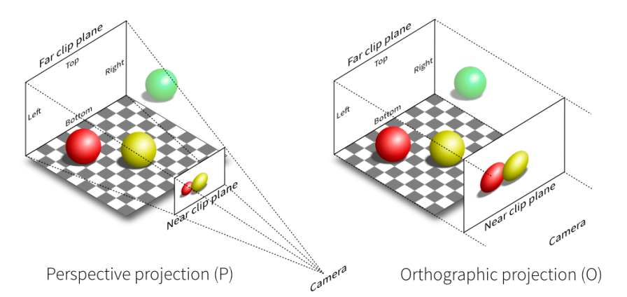
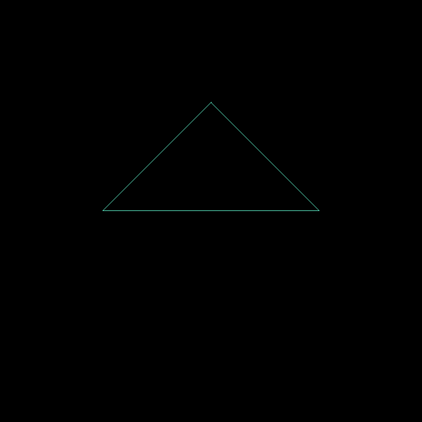
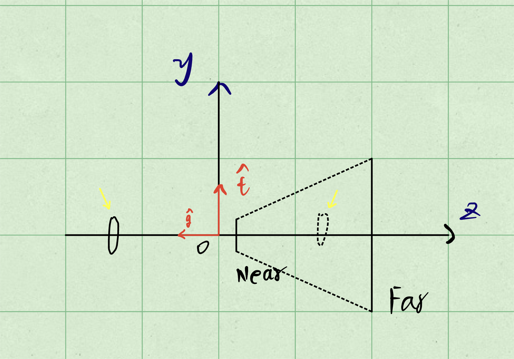
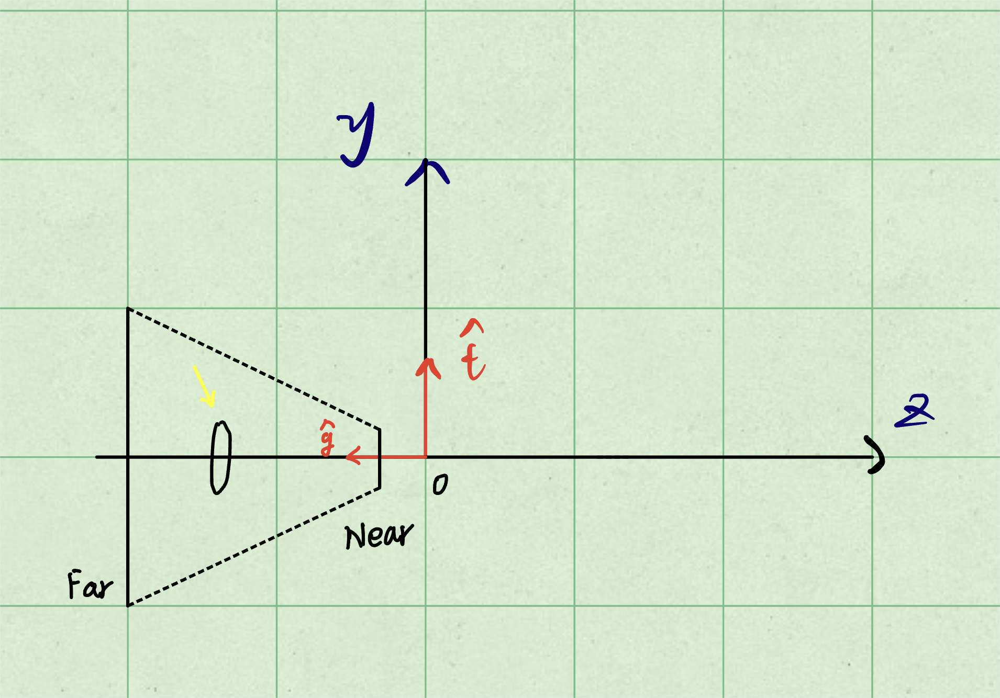

# 作业 1：旋转与投影

Created by Ccrank on 5/17/23.

## 总览

作业 1-3 的大致内容是模拟一个基于 CPU 的光栅化渲染器的简化版本。

本次作业的任务是填写一个旋转矩阵和一个透视投影矩阵。给定三维下三个
点 $v_0(2.0, 0.0, -2.0)$, $v_1(0.0, 2.0, -2.0)$, $v_2(-2.0, 0.0, -2.0)$，你需要将这三个点的坐标变换为屏幕坐标，并在屏幕上绘制出对应的线框三角形（在代码框架中，我们已经提供了`draw_triangle`函数，所以你只需要去构建变换矩阵即可）。简而言之，我们需要进行模型、视图、投影、视口等变换来将三角形显示在屏幕上。在提供的代码框架中，我们留下了模型变换和投影变换的部分给你去完成。

如果你对上述概念有任何不清楚或疑问，请复习课堂笔记或在论坛上提问。

以下是你需要在 main.cpp 中修改的函数（请不要修改任何函数名和其他已
经填写好的函数，并保证提交的代码是能编译运行的）：

- `get_model_matrix(float rotation_angle)`：逐个元素地构建模型变换矩阵并返回该矩阵。在此函数中，你只需要实现三维中绕 z 轴旋转的变换矩阵，而不用处理平移与缩放。
- `get_projection_matrix(float eye_fov, float aspect_ratio, floatzNear, float zFar)`：使用给定的参数逐个元素地构建透视投影矩阵并返回该矩阵。
- [Optional] `main()`：自行补充你所需的其他操作。

当你在上述函数中正确地构建了模型与投影矩阵，光栅化器会创建一个窗口显示出线框三角形。由于光栅化器是逐帧渲染与绘制的，所以你可以使用 `A` 和 `D` 键将该三角形绕 z 轴旋转 (此处有一项提高作业，实现将三角形绕任意过原点的轴旋转)。当你按下 `Esc` 键时，窗口会关闭且程序终止。

## 课程回顾

在完成作业内容之前，首先需要对课上的内容进行一些简单的回顾：

### 齐次坐标（Homogeneous Coordinates）

为了将线性变换（Linear Transforms）和平移（Translation）统一用矩阵来表示，引入了齐次坐标：

- 3D point = $(x, y, z, 1)^\mathsf{T}$
- 3D vector = $(x, y, z, 0)^\mathsf{T}$

对于三维空间中一个点 $(x / w, y / w, z / w)$，其齐次坐标形式为 $(wx, wy, wz, w)(w \neq 0)$。

如果结果的 $w$ 坐标为 $1$ 或 $0$，则操作有效：

- vector + vector   = vector
- point  - point    = vector
- point  + vector   = point
- point  + point    = point

> 这里点加点表示的是两个点的中点

### 仿射变换（Affine Transformations）

简单来说，仿射变换就是线性变换 + 平移。在引入齐次坐标之后仿射变换便可以通过一个矩阵直观的表达出来：

Affine map = linear map + translation

$$
\begin{pmatrix}
x' \\
y'
\end{pmatrix} =
\begin{pmatrix}
a & b \\
c & d
\end{pmatrix} \cdot
\begin{pmatrix}
x \\
y
\end{pmatrix} +
\begin{pmatrix}
t_x \\
t_y
\end{pmatrix}
$$

Using homogenous coordinates:

$$
\begin{pmatrix}
x' \\
y' \\
1
\end{pmatrix} =
\begin{pmatrix}
a & b & t_x \\
c & d &t_y \\
0 & 0 & 1
\end{pmatrix} \cdot
\begin{pmatrix}
x \\
y \\
1
\end{pmatrix}
$$

> 从这里也可以看出在仿射变换中，是先完成线性变换，然后再进行平移操作的。

#### Scale

$$
S(s_x, s_y, s_z) =
\begin{pmatrix}
s_x & 0 & 0 & 0 \\
0 & s_x & 0 & 0 \\
0 & 0 & s_z & 0 \\
0 & 0 & 0 & 1
\end{pmatrix}
$$

#### Translation

$$
T(t_x, t_y, t_z) =
\begin{pmatrix}
1 & 0 & 0 & t_x \\
0 & 1 & 0 & t_y \\
0 & 0 & 1 & t_z \\
0 & 0 & 0 & 1
\end{pmatrix}
$$

#### Rotation around x-, y-, or z-axis

$$
R_x(\alpha) =
\begin{pmatrix}
1 & 0 & 0 & 0   \\
0 & \cos{\alpha} & -\sin{\alpha} & 0    \\
0 & \sin{\alpha} & \cos{\alpha} & 0     \\
0 & 0 & 0 & 1
\end{pmatrix}
$$

$$
R_y(\alpha) =
\begin{pmatrix}
\cos{\alpha} & 0 & \sin{\alpha} & 0   \\
0 & 1 & 0 & 0    \\
-\sin{\alpha} & 0 & \cos{\alpha} & 0     \\
0 & 0 & 0 & 1
\end{pmatrix}
$$

$$
R_z(\alpha) =
\begin{pmatrix}
\cos{\alpha} & -\sin{\alpha} & 0 &  0   \\
\sin{\alpha} & \cos{\alpha} & 0 & 0    \\
0 & 0 & 1 & 0     \\
0 & 0 & 0 & 1
\end{pmatrix}
$$

同时，还有绕任意轴旋转的变换公式：

#### Rodrigues' Rotation Formula

$$
R(\boldsymbol{n}, \alpha) = \cos{(\alpha)} \boldsymbol{I} + (1 - \cos{(\alpha)}) \boldsymbol{n}\boldsymbol{n^\mathsf{T}} + \sin{(\alpha)}
\underbrace{
    \begin{pmatrix}
0       & -n_z  & n_y   \\
n_z     & 0     & -n_x  \\
-n_y    & n_x   & 0     \\
\end{pmatrix}
}_{\boldsymbol{N}}
$$

> 其中 $\boldsymbol{N}$ 为向量 $\boldsymbol{n}$ 的 叉乘矩阵。

### Model-View-Projection 矩阵变换

**Model-View-Projection** 矩阵变换简称 MVP 矩阵变换，是经模型矩阵、视图矩阵和投影矩阵三步变换将若干3D模型数据转换为视体空间的过程。

> Think about how to take a photo
>
> - Find a good place and arrange people (model transformation)
> - Find a good “angle” to put the camera (view transformation)
> - Cheese! (projection transformation)

#### Model Transformation

一个模型通常使用局部空间来定义的，因此需要通过 M transformation 将模型空间转化为世界空间。

这里通常为上面介绍的仿射变换。

#### View Transformation

**V transformation** 是将世界空间转换为观察空间，通常是将相机移动到坐标原点，并看向 Z 轴负方向。在转换相机位置的同时，对世界中所有对象也进行相同的转换，以此来保持相机观察的视角不发生改变。

首先定义相机：

- Position $\, \vec{e}$
- Look-at / gaze direction $\, \hat{g}$
- Up direction $\, \hat{t}$

那么：

$$
M_{view} = R_{view}T_{view}
$$

$$
R_{view} =
\begin{bmatrix}
x_{\hat{g} \times \hat{t}} & y_{\hat{g} \times \hat{t}} & z_{\hat{g} \times \hat{t}} & 0   \\
x_t & y_t & z_t & 0   \\
x_{-g} & y_{-g} & z_{-g} & 0     \\
0 & 0 & 0 & 1
\end{bmatrix}
\quad \quad
T_{view} =
\begin{bmatrix}
1 & 0 & 0 & -x_e   \\
0 & 1 & 0 & -y_e   \\
0 & 0 & 1 & -z_e     \\
0 & 0 & 0 & 1
\end{bmatrix}
$$

#### Projection Transformation

相机的可视区域是由其屏幕出发，沿着其观察方向（正对方向）按一定规则延伸的几何空间。由于离相机很远的几何对象对画面的贡献有限，因此考虑可视区域延伸一定距离便截止。若屏幕是平面矩形，那么可视区域是由六个平面围成的几何体，这个几何体就是相机的视锥。分别用字母 $t, b, l, r, n, f$ 表示上、下、左、右、近、远平面。

**P transformation** 是将观察空间转换为裁剪空间。即将空间中的对象，转换到摄像机所能拍摄到的屏幕中。

<div align="center"> 
    
</div>

在透视投影（Perspective Projection）中：

- 首先将这六面体“挤（squish）”进长方体中（n $\rightarrow$ n, f $\rightarrow$ n）（$M_{persp \rightarrow ortho}$）
- 然后做一个正交投影（$M_{ortho}$），将这个长方体映射到坐标原点的正方体（"canonical" cube $[-1, 1]^3$）。

那么以右手系为例：

$$
M_{persp} = M_{ortho}M_{persp \rightarrow ortho}
$$

$$
M_{ortho} =
\begin{pmatrix}
\frac{2}{r - l} & 0 & 0 & -\frac{r + l}{2}   \\
0 & \frac{2}{t - b} & 0 & -\frac{t + b}{2}   \\
0 & 0 & \frac{2}{n - f} & -\frac{n + f}{2}     \\
0 & 0 & 0 & 1
\end{pmatrix}
\quad \quad
M_{persp \rightarrow ortho} =
\begin{pmatrix}
n & 0 & 0 & 0   \\
0 & n & 0 & 0   \\
0 & 0 & n + f & -nf     \\
0 & 0 & 1 & 0
\end{pmatrix}
$$

## 作业

- `Eigen::Matrix4f get_model_matrix(float rotation_angle)`： 逐个元素地构建模型变换矩阵并返回该矩阵。在此函数中，你只需要实现三维中绕 z 轴旋转的变换矩阵，而不用处理平移与缩放。

- `Eigen::Matrix4f get_projection_matrix(float eye_fov, float aspect_ratio, float zNear, float zFar)`：使用给定的参数逐个元素地构建透视投影矩阵并返回该矩阵。

以上两个函数只需要按课程中的介绍填入相应内容即可。

- `Eigen::Matrix4f get_rotation(Vector3f anis, float angle)`：该函数的作用是得到绕任意过原点的轴的旋转变换矩阵。

这里根据课上介绍的罗德里格斯旋转公式，填写相应代码即可：

```cpp
Eigen::Matrix4f get_rotation(Vector3f anis, float angle)
{
    Eigen::Matrix4f rotation = Eigen::Matrix4f::Identity();
    Eigen::Matrix3f I = Eigen::Matrix3f::Identity();

    Eigen::Matrix3f R1, R2, R3, N;
    N << 0, -anis[2], anis[1],
        anis[2], 0, -anis[0],
        -anis[1], anis[0], 0;

    float alpha = angle / 180.0 * MY_PI;
    R1 = cos(alpha) * I;
    R2 = anis * anis.transpose() * (1 - cos(alpha));
    R3 = sin(alpha) * N;

    rotation.topLeftCorner(3, 3) = R1 + R2 + R3;

    return rotation;
}
```

### 结果

 $\quad \quad$ 

## 遇到的问题

1. 角度与弧度的问题：C++ 标准库中的 sin/cos 等计算，均以弧度为参数，角度转弧度可以用框架中提供的 `MY_PI` 常量。
2. Eigen 库使用问题：Eigen是课程代码框架中使用的线性代数运算库，常常使用在游戏开发领域。详细内容可以参考其[官方文档](https://eigen.tuxfamily.org/)。
3. 倒三角问题：由于课程代码框架中 `r.set_projection(get_projection_matrix(45, 1, 0.1, 50));` 给出的参数 `zNear` 和 `zFar` 均为正数。经过 $M, V$ 矩阵变换之后，摄像机的 $z$ 坐标为 $0$，三角形的 $z$ 坐标为 $-2$。这里三角形并不在 `zNear` 和 `zFar` 表示的视锥范围内，因此最终结果显示的三角形会产生不符合预期的结果。

<div align="center"></div>

如上图所示，黄色箭头所指向的对象，应当在视锥范围内才能够被正确渲染在屏幕上。因此，最简单的解决方案便是将课程框架代码中的参数 `zNear` 和 `zFar` 修改为 `-0.1` 和 `-50`，得到下图所示的效果。

<div align="center"></div>

## 代码框架分析

### `main.cpp`

该文件中的关键内容就是上面我们填写的各种矩阵。`main()` 函数中的代码主要是加载顶点缓冲区和索引缓冲区，这里涉及到一些渲染管线的内容，将在后面的作业中提及，同时还有处理键盘消息以实现旋转。

此外，帧缓冲区中的内容通过调用 OpenCV 库中的 API 来绘制到屏幕上，详细内容参见[官方文档](https://opencv.apachecn.org/#/)：

```cpp
cv::Mat image(700, 700, CV_32FC3, r.frame_buffer().data());
image.convertTo(image, CV_8UC3, 1.0f);
cv::imshow("image", image);
```

### `Triangle.hpp/cpp`

该文件中定义了一个 Triangle 类，主要是用来保存各个顶点的信息并提供了一些接口函数。这里包括：

- `Vector3f v[3]` 顶点坐标 $v_0, v_1, v_2$，以逆时针存储；
- `Vector3f color[3]` 顶点颜色；
- `Vector2f tex_coords[3]` 顶点纹理坐标 $u, v$；
- `Vector3f normal[3]` 顶点法线向量；

在本次作业中实际使用的只有顶点坐标信息。

### `rasterizer.hpp/cpp`

该文件作用是生成渲染器界面与绘制。

光栅化器类在该程序系统中起着重要的作用，其成员变量与函数如下。

成员变量：

- `Eigen::Matrix4f model, view, projection`：三个变换矩阵；
- `std::vector<Vector3f> frame_buf`：帧缓冲对象，用于存储需要在屏幕上绘制的颜色数据；
- `std::vector<float> depth_buf`：深度缓冲对象，用于深度测试；

成员函数：

- `set_pixel(Vector2f point, Vector3f color)`：将屏幕像素点 $(x, y)$ 设为 $(r, g, b)$ 的颜色，并写入相应的帧缓冲区位置；
- `clear(Buffers buff)`：清理屏幕，将帧缓冲对象全置为 0，并将深度缓冲对象全置为正无穷（`std::numeric_limits<float>::infinity()`）；
- `draw(pos_buf_id pos_buffer, ind_buf_id ind_buffer, Primitive type)`：将输入的坐标经过矩阵变换转换到屏幕坐标，并在两点之间画线；

其中主要的逻辑是 `draw()` 函数，下面对其进行详细分析。

首先是根据给定的起始顶点位置和起始索引位置，从缓冲区中读取相应的顶点和索引数据。

```cpp
auto& buf = pos_buf[pos_buffer.pos_id];
auto& ind = ind_buf[ind_buffer.ind_id];
```

求 $MVP$ 矩阵，并将顶点坐标进行 $MVP$ 变换。然后对每一个顶点做透视除法，得到规范视锥中的顶点。

```cpp
Eigen::Matrix4f mvp = projection * view * model;
```

```cpp
Eigen::Vector4f v[] = {
        mvp * to_vec4(buf[i[0]], 1.0f),
        mvp * to_vec4(buf[i[1]], 1.0f),
        mvp * to_vec4(buf[i[2]], 1.0f)
};

for (auto& vec : v) {
    vec /= vec.w();
}
```

接下来相当于对顶点坐标进行视口变换（Viewport transform）,将原本的裁剪空间坐标映射到屏幕空间中。同时 z 值也从 $[-1, 1]$ 重新映射到了 $[0.1, 100]$ 这个区间，这主要是为了后续z-buffer考虑。这里 x, y 的视口变换也可以写成矩阵形式有：

$$
M_{viewport} =
\begin{pmatrix}
\frac{width}{2} & 0 & 0 & \frac{width}{2}   \\
0 & \frac{height}{2} & 0 & \frac{height}{2}   \\
0 & 0 & 1 & 0     \\
0 & 0 & 0 & 1
\end{pmatrix}
$$

```cpp
float f1 = (100 - 0.1) / 2.0;
float f2 = (100 + 0.1) / 2.0;

for (auto & vert : v)
{
    vert.x() = 0.5*width*(vert.x()+1.0);
    vert.y() = 0.5*height*(vert.y()+1.0);
    vert.z() = vert.z() * f1 + f2;
}
```

最后生成 `Triangle` 对象，设置顶点颜色（这里没有什么用），并光栅化线框。

```cpp
Triangle t;
for (int i = 0; i < 3; ++i)
{
    t.setVertex(i, v[i].head<3>());
    t.setVertex(i, v[i].head<3>());
    t.setVertex(i, v[i].head<3>());
}

t.setColor(0, 255.0,  0.0,  0.0);
t.setColor(1, 0.0  ,255.0,  0.0);
t.setColor(2, 0.0  ,  0.0,255.0);

rasterize_wireframe(t);
```

在光栅化线框的函数中，调用了 `draw_line(Vector3f begin, Vector3f end)` 函数来绘制连线，该函数使用[Bresenham's算法](https://en.wikipedia.org/wiki/Bresenham's_line_algorithm)来画线，代码作者也指出该算法代码来自于Stack Overflow中的一则[答案](https://stackoverflow.com/a/16405254)。
