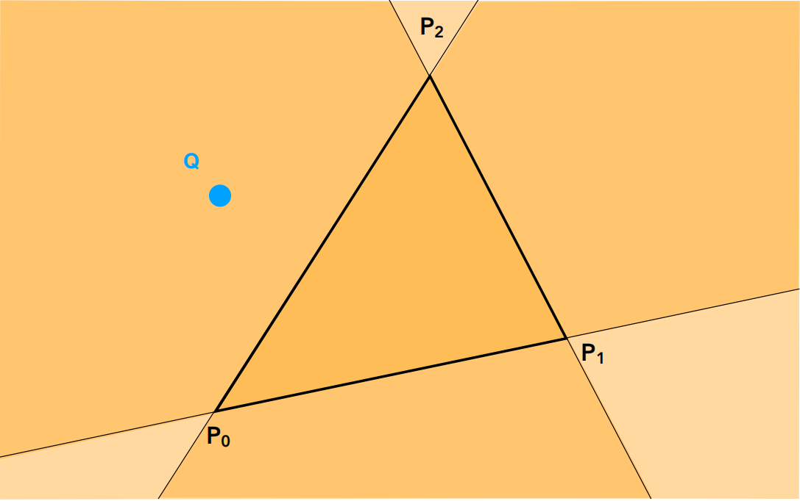
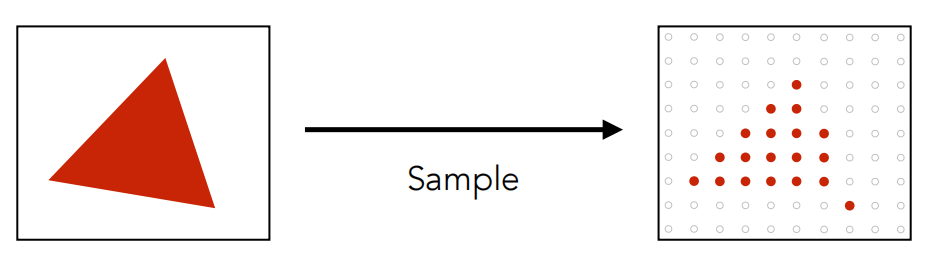

# 作业 2：旋转与投影

Created by Ccrank on 5/18/23.

## 总览

作业 1-3 的大致内容是模拟一个基于 CPU 的光栅化渲染器的简化版本。

在上次作业中，虽然我们在屏幕上画出一个线框三角形，但这看起来并不是那么的有趣。所以这一次我们继续推进一步——在屏幕上画出一个实心三角形，换言之，栅格化一个三角形。上一次作业中，在视口变化之后，我们调用了函数 `rasterize_wireframe(const Triangle& t)`。但这一次，你需要自己填写并调用函数 `rasterize_triangle(const Triangle& t)`。

该函数的内部工作流程如下：

1. 创建三角形的 2 维 bounding box.
2. 遍历此 bounding box 内的所有像素（使用其**整数**索引）。然后，使用像素中心的屏幕空间坐标来检查中心点是否在三角形内。
3. 如果在内部，则将其位置处的**插值深度值** (interpolated depth value) 与深度缓冲区 (depth buffer) 中的相应值进行比较。
4. 如果当前点更靠近相机，请设置像素颜色并更新深度缓冲区 (depth buffer)。

你需要修改的函数如下：

- `rasterize_triangle()`：执行三角形栅格化算法
- `static bool insideTriangle()`：测试点是否在三角形内。你可以修改此函数的定义，这意味着，你可以按照自己的方式更新返回类型或函数参数。

因为我们只知道三角形三个顶点处的深度值，所以对于三角形内部的像素，我们需要用插值的方法得到其深度值。我们已经为你处理好了这一部分，因为有关这方面的内容尚未在课程中涉及。插值的深度值被储存在变量 `z_interpolated` 中。

## 课程回顾

在完成作业内容之前，首先需要对课上的内容进行一些简单的回顾：

### ViewPort Transformation

在完成 MVP 矩阵变换之后，所有对象都会被“挤”进一个标准立方体中。接下来要做的就是将这个 $[-1, 1]^2$ 的立方体在 $[0, width] \times [0, height]$ 的屏幕展现出来，也就是将裁剪空间映射到屏幕空间。因此视口转换矩阵有：

$$
M_{viewport} =
\begin{pmatrix}
\frac{width}{2} & 0 & 0 & \frac{width}{2}   \\
0 & \frac{height}{2} & 0 & \frac{height}{2}   \\
0 & 0 & 1 & 0     \\
0 & 0 & 0 & 1
\end{pmatrix}
$$

### Rasterization: Drawing to Raster Displays

当在屏幕空间中的得到三角形的顶点之后，接下来便是画三角形了。在屏幕空间中，像素都是以离散的方式排列的，该怎么用像素来近似一个三角形呢？一个简单且直接的方法，就是采样（Sampling）。

在某个点上计算一个函数就是采样。我们可以通过抽样来离散一个函数。采样是图形学中的一个核心思想，采样时间（1D）、面积（2D）、方向（2D）、体积（3D）等等。

要对三角形进行采样，需要判断当前像素是否在三角形内部。该问题可以规约为 **如何判断一个点是否在一个凸多边形内?**，这通常有很多中方法：

1. 面积和判别法：判断目标点与多边形的每条边组成的三角形面积和是否等于该多边形，相等则在多边形内部。
2. 夹角和判别法：判断目标点与所有边的夹角和是否为360度，为360度则在多边形内部。
3. 引射线法：从目标点出发引一条射线，看这条射线和多边形所有边的交点数目。如果有奇数个交点，则说明在内部，如果有偶数个交点，则说明在外部。
4. ***叉乘法***：这是计算量最少的一种方法。假设三角形三个点按照顺时针（逆时针）顺序是 A, B, C。对于某一点 P，求出三个向量 PA, PB, PC，然后计算以下三个叉乘：
   - $t1 = PA \times PB$
   - $t2 = PB \times PC$
   - $t3 = PC \times PA$
  
    如果 $t1, t2, t3$ 同号（同正或者同负），那么 P 在三角形内部，否则在外部。

<div align="center"></div>

当有了 inside triangle 函数之后，只需要遍历每一个点就可以得出三角形的光栅化结果了.当然还可以进一步的进行优化，因为显然并没有必要去测试屏幕中的每一个点，一个三角形面可能只占屏幕很小的部分，可以利用一个 axis-aligned bounding box(AABB) 包围住想要测试的三角形，简单地遍历三角形的 AABB 即可完成对三角形的采样：

```cpp
for (int x = xmin; x < xmax; ++x) 
    for (int y = ymin; y < ymax; ++y) 
        image[x][y] = inside(tri, x + 0.5, y + 0.5);
```

由于三角形在三维空间中是一个连续的，但在完成采样之后，最终显示在屏幕上的却是一个离散的由像素组成的二维数组。所以判断一个点到底没有被某个像素覆盖的时候单纯是一个“有”或者“没有"问题，丢失了连续性的信息，这就导致了锯齿（Jaggies），也叫走样（Aliasing）。

<div align="center"></div>

这种问题本质是因为在采样的时候的频率过低而丢失了高频部分的信息，导致最后结果的失真，当然这是从信号处理的角度去看这个问题，详细信息可以参考闫老师的视频。为了解决这个问题，通常有两种选项。第一种是增加采样频率，这本质上是增加了傅里叶域中副本之间的距离
，但这通常需要更高的分辨率和更高的成本。第二种是反走样（Anti-aliasing），也就是抗锯齿，这主要是在发生重叠前使傅里叶内容“变窄”，即在采样前过滤掉高频信息。

因此，一个朴素的抗锯齿思路就是，通过计算像素区域中的平均值来消除锯齿。

### Supersampling

通过对一个像素内的多个位置进行采样并平均其值，近似1像素滤波器的效果。拿 4xSSAA 举例子，假设最终屏幕输出的分辨率是 800x600， 4xSSAA 就会先渲染到一个分辨率 1600x1200 的 buffer 上，然后再直接把这个放大 4 倍的 buffer 下采样致 800x600。这种做法在数学上是最完美的抗锯齿。但是劣势也很明显，光栅化和着色的计算负荷都比原来多了 4 倍，render target 的大小也涨了4倍。

#### Others

- 空间抗锯齿使用 MSAA（Multi-sample Anti-Aliasing）。SSAA 是使用多倍的屏幕分辨率大小的后台缓冲区和深度缓冲区，如 4xMSAA 使用 4 倍屏幕分辨率。MSAA 将 SSAA 中的 per Sample Shading 优化到了 Per Pixel Shading，以此来减小对 GPU 的运算负荷，但这对内存需求并没有减少。在延时渲染管线中难以支持 。
    > MSAA 则很聪明的只是在光栅化阶段，判断一个三角形是否被像素覆盖的时候会计算多个覆盖样本（Coverage sample），但是在 pixel shader 着色阶段计算像素颜色的时候每个像素还是只计算一次。例如下图是 4xMSAA，三角形只覆盖了 4 个 coverage sample 中的 2 个。所以这个三角形需要生成一个 fragment 在 pixel shader 里着色，只不过生成的 fragment 还是在像素中央（位置，法线等信息插值到像素中央）然后只运行一次 pixel shader，最后得到的结果在 resolve 阶段会乘以 0.5，因为这个三角形只 cover 了一半的 sample。现代所有 GPU 都在硬件上实现了这个算法，而且在 shading 的运算量远大于光栅化的今天，这个方法远比 SSAA 快很多。
    >
    > MSAA 的一个问题就是和现在大街小巷都是的 deferred shading 框架并不是那么兼容。因为用 deferred shading 的时候场景都先被光栅化到 GBuffer 上去了，不直接做 shading。

- 图像抗锯齿也称后处理抗锯齿 FXAA（Fast Approximate AA）：得到一副有锯齿的图，通过图像匹配的方法找到这些锯齿边界，并将这些边界替换为没有锯齿的边界。这时一种和采样无关的图像层面的抗锯齿工作。这一类方法速度快，引擎集成也比较简单但同 MSAA 一样，无法解决次像素信息缺失和着色锯齿的问题。
- 时间抗锯齿使用 TAA（Temporal Anti-Aliasing）：把样本分布到过去的N帧中去，然后每一帧从过去的 N 帧中取得样本信息然后 Filter。即复用过去帧中采样的像素，在避免性能损失的情况下近似 Super Sampling 的效果。

### Z-Buffer

以上是只有一个三角形的光栅化过程，但当场景中有许多三角形，且三角形之间相互覆盖，这时该如何确定这些三角形的绘制顺序呢？Z-Buffer。

Z-Buffer 算法存储每个样本（像素）中 z 值的最小值（即里摄像机最近的 z 值），这需要一个额外的 buffer 来记录深度值。首先将所有 buffer 初始值置为无穷大，然后在光栅化过程中，对于每一个三角形的每一个采样点，判断当前采样点的深度值是否小于 Z-Buffer 中的深度值。如果

## Reference

[1] 请问FXAA、FSAA与MSAA有什么区别？效果和性能上哪个好？ - [文刀秋二的回答](https://www.zhihu.com/question/20236638/answer/44821615) - 知乎

[2] 计算机图形学四：抗锯齿SSAA及MSAA算法和遮挡剔除Z-Buffer算法 - [孙小磊的文章](https://zhuanlan.zhihu.com/p/144331249) - 知乎
