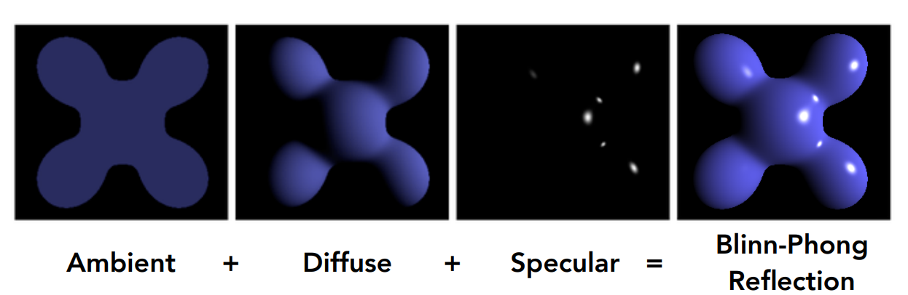
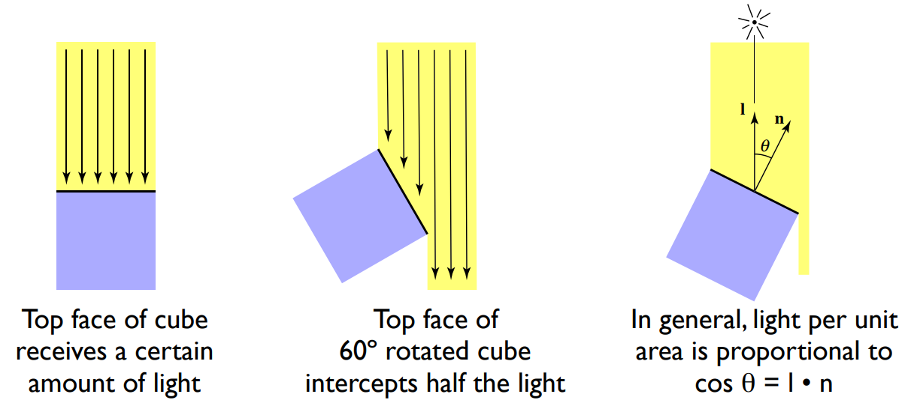
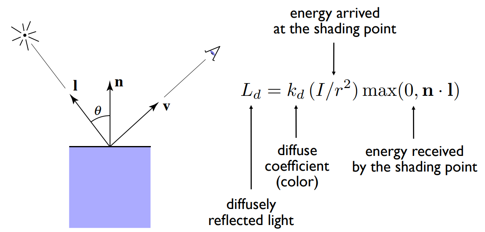
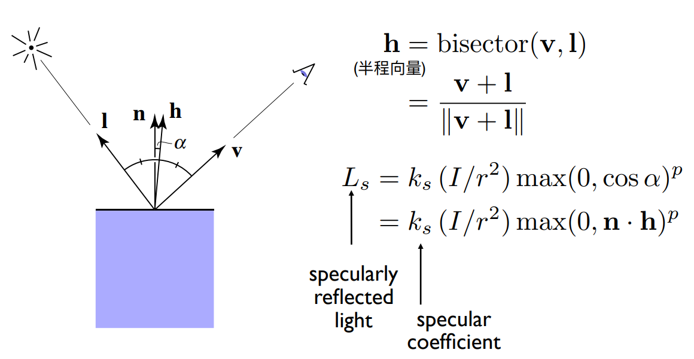
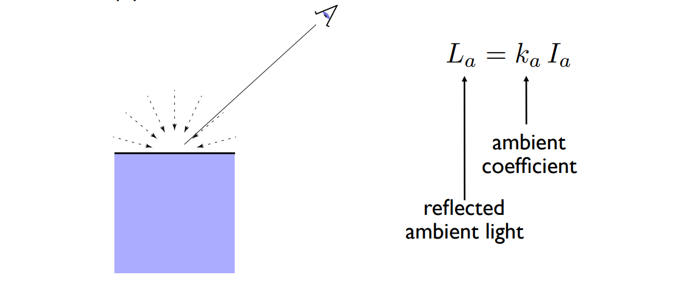

# Shading 着色

## Blinn-Phong 反射模型

Blinn-Phong 模型，又称为 Blinn-phong 反射模型（Blinn–Phong reflection model）或者 phong 修正模型（modified Phong reflection model），是由 Jim Blinn 于 1977 年在文章中对传统 phong 光照模型基础上进行修改提出的。它是一个经验模型，并不完全符合真实世界中的光照现象，但由于实现起来简单方便，并且计算速度和得到的效果都还不错，因此在早期被广泛的使用。

它将进入摄像机的光线分为三个部分，每个部分使用一种方法来计算它的贡献度，这三个部分分别是环境光（Ambient）、漫反射（Diffuse）和高光反射（Specular）。



首先简单介绍一下模型中涉及到了几个个基本向量。其中， $l$ 是从着色点指向光源位置的向量， $n$ 表示着色点的法向量， $v$ 是从着色点指向相机（观察者）的向量， $h$ 被称为半程向量，它是光线方向 $l$ 和 观察方向 $v$ 取平均然后归一化得到的一个新向量。Blinn 在原本 Phong 模型的基础上改用 $h$ 与法线 $n$ 点乘来计算高光，这样就可以避免计算反射方向 $R$ ，从而极大的减少了运算量。

> 在本文中，我们假定所有的向量都已经归一化。

### Diffuse Term 漫反射项

当光线照射到一个点时，该光线会被均匀的散射到各个方向，这种反射称为漫反射。在漫反射中，漫反射光在任何反射方向上的分布都是一样的，也就是说，所有观察方向观察到的着色点的颜色都是一样的。

> 兰伯特余弦定律(Lambert Consine Law)中指出，漫反射的大小取决于表面法线和光线的夹角，当夹角越大时，漫反射分量越小，当夹角接近90度时，则认为漫反射几乎为零。



也就是说，只有入射光线的垂直分量才对照明起到作用。根据 Lambert 定律，反射光线的强度与表面法线和光源方向之间夹角的余弦值成正比。当表面法线与光线的夹角大于 90 度，它们的余弦值小于 0，这没有实际意义，因此将其置为 0。

此外，这里定义了入射光线强度会随着距离的增加而衰减。这是很符合直觉的，假设有一个光源，在距离它单位 1 的圆上每一个点接收到光的强度（intensity）是 $I$。那么根据能量守恒定律，在距离光源 $r$ 位置的圆上每个点接收到 intensity 就是 $I/r^2$。

这样，就得到了漫反射项的计算公式：



通常，漫反射系数 $k_d$ 为当前着色点的颜色（color）。

```cpp
    Eigen::Vector3f point = payload.view_pos;
    Eigen::Vector3f normal = payload.normal;
    Eigen::Vector3f l = (light.position - point).normalized();

    Eigen::Vector3f kd = payload.color;
    Eigen::Vector3f energyAtShadingPoint = light.intensity / (light.position - point).dot(light.position - point);
    auto Ld = kd.cwiseProduct(energyAtShadingPoint) * std::max(0.0f, normal.dot(l));
```

### Specular Term 高光项

漫反射是用于模拟粗糙表面的，而镜面反射是用于模拟光滑表面的。反射出去的光线越集中在一个角度附近，越接近真实的镜子。因此高光项依赖于观察方向（View Direction），即在靠近镜面反射方向时物体变得明亮，并观察到高光。

Phong 模型中认为，高光反射的强度与反射光线 $R$ 和观察角度 $v$ 之间夹角的余弦值成正比。计算它的强度，相当于是求向量 $v$ 在 $R$ 上的投影。而计算 $R$ 需要很复杂的计算过程： $R = l - 2(l \cdot n) \cdot n$ 。

从而有完整的高光反射公式：

$$
\begin{aligned}
L_s &= k_s(I / r^2) \max{(0, \cos{\alpha})^{p}} \\
    &= k_s(I / r^2) \max{(0, v \cdot R)}
\end{aligned}
$$

其中 $k_s$ 是高光反射系数， $I/r^2$ 是当前点接受的光照强度，这里的指数 $p$ 是为了控制高光反射面积的大小和能够看到高光的范围。增加 $p$ 会使反射瓣变窄，即高光面积越小。其通常取值 100-200 之间。

Blinn 针对 Phong 模型的高光项的计算提出了改进，提出了半程向量（Bisector）的概念。通过对向量 $l$ 和向量 $v$ 取平均然后归一化得到一个新的向量 $h$ ，其中 $h$ 被称为半程向量，而观察向量 $v$ 与 镜面反射向量 $R$ 的度量可以用半程向量 $h$ 和法线向量 $n$来代替，这样便极大简化了计算过程，从而得到 Blinn-Phong 模型的高光项。



通常，高光系数 $k_s$ 是预先定义好的常数， $p$ 通常取值为 32。

```cpp
    Eigen::Vector3f point = payload.view_pos;
    Eigen::Vector3f normal = payload.normal;
    Eigen::Vector3f l = (light.position - point).normalized();
    Eigen::Vector3f v = (eye_pos - point).normalized();
    Eigen::Vector3f h = (l + v).normalized();

    Eigen::Vector3f ks = Eigen::Vector3f(0.7937, 0.7937, 0.7937);
    Eigen::Vector3f energyAtShadingPoint = light.intensity / (light.position - point).dot(light.position - point);
    auto Ls = ks.cwiseProduct(energyAtShadingPoint) * std::pow(std::fmax(0.0f, normal.dot(h)), p);
```

### Ambient Term 环境光项

环境光是照射在其它物体上的光先反射到观察物体上，通过观察物体表面再反射至视角中。
这里假设***任何一个点接受到的来自环境的光照都是相同的***。通过这一假设，将原本复杂的环境光照大大了简化了，并将环境光定义为一个光源的角度无关，与观察角度也无关的常数。当然，这种假设是近似的、错误的，后来的全局光照对环境光进行了更精确的近似。



通常，环境光系数 $k_a$ 与环境光强度 $I_a$ 均是预先定义好的常数。

```cpp
    Eigen::Vector3f ka = Eigen::Vector3f(0.005, 0.005, 0.005);
    Eigen::Vector3f amb_light_intensity{10, 10, 10};
    auto La = ka.cwiseProduct(amb_light_intensity);
```

## Reference

[1] [GAMES101-现代计算机图形学入门](https://www.bilibili.com/video/BV1X7411F744/?p=8&share_source=copy_web&vd_source=0010cd145c4589a828366dd2f6c17219) - 闫令琪

[2] [Blinn-Phong光照模型从定义到实现](https://zhuanlan.zhihu.com/p/442023993) - Ruyi Y的文章 - 知乎
