# Shading 着色

过去，基本的光照模型主要有以下几种：

1. Lambert 光照模型是光源照射到物体表面后，向四面八方反射，产生的漫反射效果。这是一种理想的漫反射光照模型。它将环境光 Ambient 和 方向光源 LightColor 对模型的贡献综合考虑起来：
2. Gouraud 着色模型先是计算三角形的每个顶点的光照，然后用顶点颜色通过插值处理计算三角形内部的光照颜色。通常在shader代码的顶点着色器中处理光照。
3. Phong 模型对顶点法向量 $n$、执行光源的方向向量 $l$ 和观察者的视线方向 $v$ 进行插值，计算每个像素的光照。同时也在 Lambert 模型的基础上增加了镜面反射项，即高光项。
4. Blinn-Phong 模型一个基于 Phong 模型修正的模型，它引入半程向量来减少着色过程中的计算量。

## Blinn-Phong 反射模型

Blinn-Phong 模型，又称为 Blinn-phong 反射模型（Blinn–Phong reflection model）或者 phong 修正模型（modified Phong reflection model），是由 Jim Blinn 于 1977 年在文章中对传统 phong 光照模型基础上进行修改提出的。它是一个经验模型，并不完全符合真实世界中的光照现象，但由于实现起来简单方便，并且计算速度和得到的效果都还不错，因此在早期被广泛的使用。

它将进入摄像机的光线分为三个部分，每个部分使用一种方法来计算它的贡献度，这三个部分分别是环境光（Ambient）、漫反射（Diffuse）和高光反射（Specular）。


首先简单介绍一下模型中涉及到了几个个基本向量。其中， $l$ 是从着色点指向光源位置的向量， $n$ 表示着色点的法向量， $v$ 是从着色点指向相机（观察者）的向量， $h$ 被称为半程向量，它是光线方向 $l$ 和 观察方向 $v$ 取平均然后归一化得到的一个新向量。Blinn 在原本 Phong 模型的基础上改用 $h$ 与法线 $n$ 点乘来计算高光，这样就可以避免计算反射方向 $R$ ，从而极大的减少了运算量。

> 在本文中，我们假定所有的向量都已经归一化。

```cpp
    Eigen::Vector3f point = payload.view_pos;
    Eigen::Vector3f normal = payload.normal;
    Eigen::Vector3f l = (light.position - point).normalized();
    Eigen::Vector3f v = (eye_pos - point).normalized();
    Eigen::Vector3f h = (l + v).normalized();
```

### Diffuse Term 漫反射项

当光线照射到一个点时，该光线会被均匀的散射到各个方向，这种反射称为漫反射。在漫反射中，漫反射光在任何反射方向上的分布都是一样的，也就是说，所有观察方向观察到的着色点的颜色都是一样的。

> 兰伯特余弦定律(Lambert Consine Law)中指出，漫反射的大小取决于表面法线和光线的夹角，当夹角越大时，漫反射分量越小，当夹角接近90度时，则认为漫反射几乎为零。


也就是说，只有入射光线的垂直分量才对照明起到作用。根据 Lambert 定律，反射光线的强度与表面法线和光源方向之间夹角的余弦值成正比。当表面法线与光线的夹角大于 90 度，它们的余弦值小于 0，这没有实际意义，因此将其置为 0。

此外，这里定义了入射光线强度会随着距离的增加而衰减。这是很符合直觉的，假设有一个光源，在距离它单位 1 的圆上每一个点接收到光的强度（intensity）是 $I$。那么根据能量守恒定律，在距离光源 $r$ 位置的圆上每个点接收到 intensity 就是 $I/r^2$。

这样，就得到了漫反射项的计算公式：


通常，漫反射系数 $k_d$ 为当前着色点的颜色（color）。

```cpp
    Eigen::Vector3f kd = payload.color;
    Eigen::Vector3f energyAtShadingPoint = light.intensity / (light.position - point).dot(light.position - point);
    auto Ld = kd.cwiseProduct(energyAtShadingPoint) * std::max(0.0f, normal.dot(l));
```

### Specular Term 高光项

漫反射是用于模拟粗糙表面的，而镜面反射是用于模拟光滑表面的。反射出去的光线越集中在一个角度附近，越接近真实的镜子。因此高光项依赖于观察方向（View Direction），即在靠近镜面反射方向时物体变得明亮，并观察到高光。

Phong 模型中认为，高光反射的强度与反射光线 $R$ 和观察角度 $v$ 之间夹角的余弦值成正比。计算它的强度，相当于是求向量 $v$ 在 $R$ 上的投影。而计算 $R$ 需要很复杂的计算过程： $R = l - 2(l \cdot n) \cdot n$ 。

从而有完整的高光反射公式：

$$
\begin{aligned}
L_s &= k_s(I / r^2) \max{(0, \cos{\alpha})^{p}} \\
    &= k_s(I / r^2) \max{(0, v \cdot R)}
\end{aligned}
$$

其中 $k_s$ 是高光反射系数， $I/r^2$ 是当前点接受的光照强度，这里的指数 $p$ 是为了控制高光反射面积的大小和能够看到高光的范围。增加 $p$ 会使反射瓣变窄，即高光面积越小。其通常取值 100-200 之间。

Blinn 针对 Phong 模型的高光项的计算提出了改进，提出了半程向量（Bisector）的概念。通过对向量 $l$ 和向量 $v$ 取平均然后归一化得到一个新的向量 $h$ ，其中 $h$ 被称为半程向量，而观察向量 $v$ 与 镜面反射向量 $R$ 的度量可以用半程向量 $h$ 和法线向量 $n$来代替，这样便极大简化了计算过程，从而得到 Blinn-Phong 模型的高光项。


通常，高光系数 $k_s$ 是预先定义好的常数， $p$ 通常取值为 32。

```cpp
    Eigen::Vector3f ks = Eigen::Vector3f(0.7937, 0.7937, 0.7937);
    Eigen::Vector3f energyAtShadingPoint = light.intensity / (light.position - point).dot(light.position - point);
    auto Ls = ks.cwiseProduct(energyAtShadingPoint) * std::pow(std::fmax(0.0f, normal.dot(h)), p);
```

### Ambient Term 环境光项

环境光是照射在其它物体上的光先反射到观察物体上，通过观察物体表面再反射至视角中。
这里假设***任何一个点接受到的来自环境的光照都是相同的***。通过这一假设，将原本复杂的环境光照大大了简化了，并将环境光定义为一个光源的角度无关，与观察角度也无关的常数。当然，这种假设是近似的、错误的，后来的全局光照对环境光进行了更精确的近似。


通常，环境光系数 $k_a$ 与环境光强度 $I_a$ 均是预先定义好的常数。

```cpp
    Eigen::Vector3f ka = Eigen::Vector3f(0.005, 0.005, 0.005);
    Eigen::Vector3f amb_light_intensity{10, 10, 10};
    auto La = ka.cwiseProduct(amb_light_intensity);
```

### Gamma 矫正

由于早期 CRT 显示器的问题，即输出的亮度和输入的电压并非线性关系，而是近似 2.2 次幂的关系，导致进入人眼的亮度要比计算机上存储的亮度要低。例如，计算机上存储的亮度为 0.5，经过显示器调整后变为 0.5 的 2.2 次幂，即 0.218。为了让进入人眼的亮度与计算机中存储的值相同，需要在显示器调整前将亮度变为自身的 1/2.2 次幂，即 0.73，这样在经过显示器的调整，进入人眼就是 0.5 了，也就是说，Gamma 校正可以补偿由于显示器造成的亮度下降。这里需要注意的是，2.2 这个值是一个近似值，或者可以说是一个标准，实际上可能会有不同，现在的显示器甚至可以调节。

<div align="center">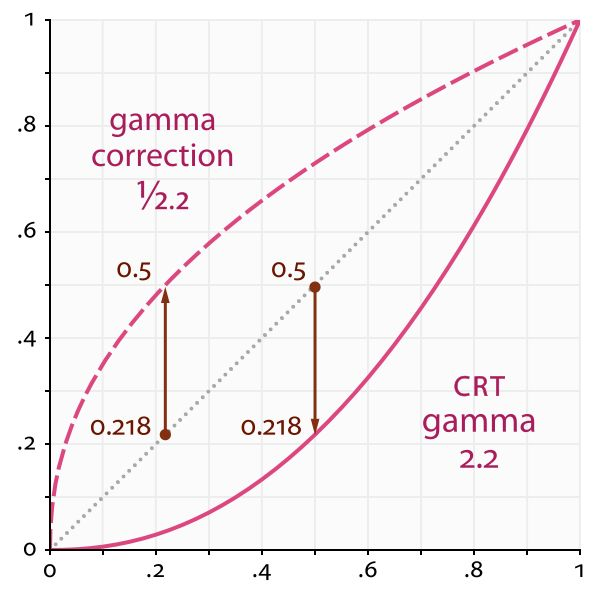</div>

上图中横坐标为输入值，纵坐标为输出值，中间的点线是物理亮度值，也是线性空间中的值，下方的实线是经过显示器校正的曲线，而上方的虚线是我们提高亮度或者说增大暗部存储范围后的曲线。

#### 提高暗部亮度值存储范围的原理

sRGB 空间有一个很重要的作用，就是我们用来存储颜色的媒介往往不够存储很多细节，比如常用的 RGBA32，每一个通道只有 8 位，即 0 到 255，只能存 256 个级别的亮度，这会丢失很多物理世界里的真实信息。那么如何在不增加存储范围的情况下，尽可能保留更多的物理信息呢？答案是，通过 Gamma 校正，把较暗的部分的存储范围放大，当然这会导致较亮的部分丢掉一些细节。这么做的依据是前面提到的人眼对暗部更敏感，所以应该用更多的范围去存储较暗的部分，而亮的部分，即使丢失掉一些细节也没关系，因为人眼可能并不会感知到。

通过上面的图可以看到，在物理世界中，假设摄像机采样到的亮度为 0.218，如果就这么直接存储，那么采样的所有 0.218 以下的亮度都只能保存在 0.218 这个值以下，换成 8 位二进制表示只有 256 乘 0.218 等于 55 个级别。而 0.782 到 1 的值直接保存的话，也是 55 个级别，这样就造成了浪费，因为我们对 0 到 0.218 这个范围的敏感程度要大于 0.782 到 1 这个范围，而这两个范围都用 55 个亮度级别去表示，这就会使得我们本来可以感觉的更多的暗部的细节，但现在感觉不到了。

当我们将物理世界中采样的亮度变为它的 0.45 次幂，也就是上图中上方的虚线，情况就会不一样。0 到 0.218 这个范围会变为 0 到 0.5，也就是说我们可以用 128 个级别去存储 0 到 0.218 这个范围，这样我们可以感受到 128 个级别的亮度，而 0.782 到 1 经过 Gamma 校正后的范围是 0.9 到 1，也就是只有 26 个级别。这符合我们人眼的特性，前面提到过，人眼感知物理亮度在暗部更敏感。

### 最终着色

因此，在最终的颜色输出时应当对颜色做一个 Gamma 矫正，从而使得输出更加符合人眼观察的习惯。

这里的 $\gamma$ 通常取值为 2.2。

```cpp
    auto L =  La + Ld + Ls;
    vec3 phongColor = pow(L, vec3(1.0 / 2.2)) * 255.f;
```

<div align="center">
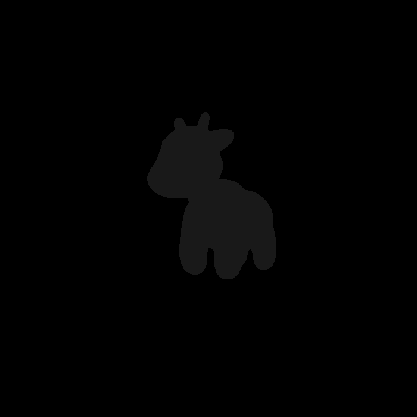
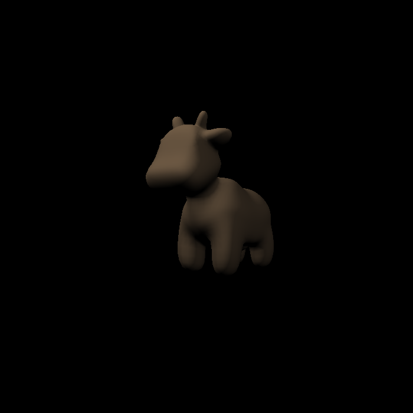
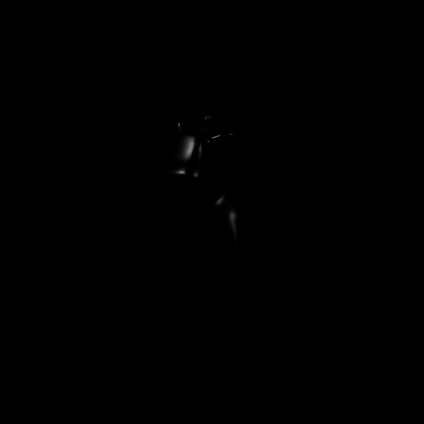
</div>

$$
\begin{aligned}
L   &= L_a + L_d + Ls\\
    &= k_a I_a + k_d(I/r^2)max(0, \boldsymbol{n} \cdot \boldsymbol{l}) + k_s(I/r^2)max(0, \boldsymbol{n} \cdot \boldsymbol{h})^p
 \end{aligned}
$$

<div align="center">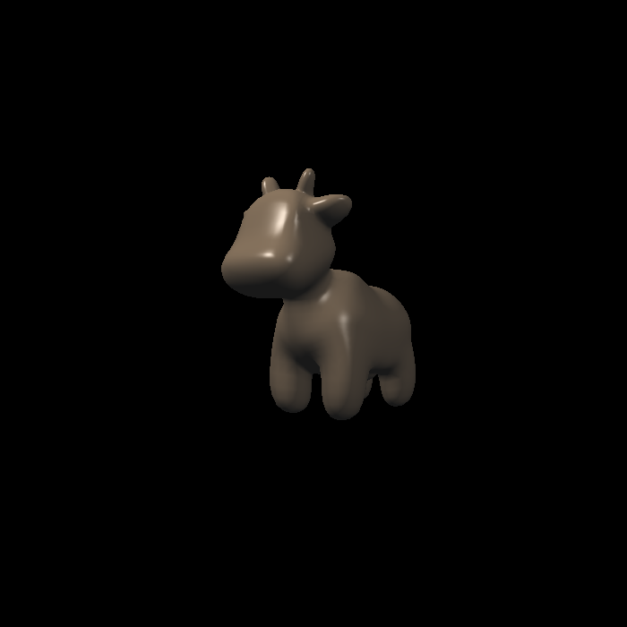</div>

## 实时渲染管线 Real-Time Rendering Pipeline

渲染管线，就是渲染过程流水线，是一个流程。它的输入是一堆原始图形数据，经过各种变化处理后，最终将结果输出在屏幕的过程。渲染管线可以分为三个阶段，应用程序阶段，几何阶段，和光栅化阶段。

<div align="center"></div>

### 应用程序阶段

应用程序阶段的主要任务是输入装配，由 CPU 负责。CPU 将 GPU 渲染需要的灯光、模型准备好，随后向 GPU 下达一个渲染指令 `Draw Call`，即往命令缓冲区中放入命令，GPU 则依次取出命令执行。

### 几何阶段

几何阶段在 GPU 上运行，它处理应用阶段发送的渲染图元，负责大部分的逐三角性和逐顶点操作。几何阶段的一个重要任务就是把顶点坐标变换到屏幕空间中 ，再交给光栅器进行处理。通过对输入的渲染图元进行多步处理后，这一阶段将会输出屏幕空间的二维顶点坐标、每个顶点对应的深度值、着色等相关信息，并传递给光栅化阶段。

几何阶段包括四个过程：顶点着色(Vertex Shading)，投影变换(Projection)，裁剪(Clipping)和屏幕映射(Screen Mapping)。

此外还有一些可选的操作如：坐标变换、曲面细分着色器、几何着色器等。

### 光栅化阶段

光栅化阶段把图元映射为最终屏幕上显示的颜色，包括光栅化，片段着色器，透明度测试和模板测试等。

光栅化将顶点转为屏幕上的像素，会进行三角形遍历。三角型遍历，检测出所有被三角型覆盖的像素。（此处可拓展出怎么划分片元、怎么抗锯齿）

片段着色器计算每个像素的最终颜色。是一个可编程的阶段，主要的光照处理都在这个阶段。

透明度（Alpha）测试通过深度信息决定像素是否显示。可设置阈值，显示的像素将与颜色缓冲区中颜色混合。

模板测试通过片元的模板值与模板缓冲区的模板值的比较来筛选像素。

深度测试通过深度信息判断像素的遮挡关系。筛选掉被遮挡的像素。现在大多数 GPU 都支持提前深度测试(Early depth testing)，在片元着色器之前测试，由硬件功能完成。

最终渲染好的颜色先被送入后置缓冲，随后再替换前置缓冲，显示在屏幕上。

## 纹理映射 Texture Mapping

### 重心坐标 Barycentric Coordinates

在着色过程中，通常都是逐像素进行着色，但实际上我们只定义了三角形三个顶点上的属性，而三角形内部的属性往往都是未知的。这就需要对三角形内的每个像素进行插值，从而得到一个平滑的过度。那么，当已知三角形三个顶点的属性，如何在三角形内部进行任意属性（位置、纹理坐标、颜色、法线、深度、材质属性..）的插值呢？由此，**重心坐标**的概念被引入来解决这个问题。

重心坐标 $(\alpha, \beta, \gamma)$ 是由三角形顶点定义的坐标：

- 三角形上的任一顶点 $(x,y)$ 都可以表示为三角形三个顶点的线性组合： $(x, y) = \alpha A + \beta A + \gamma c$ ；
- 且系数之和为 1： $\alpha + \beta + \gamma = 1$ (只有系数之和为 1，点才在这个三角形所在的平面上)；
- 当满足三个系数都为非负数时，该点在三角形内部，反之，该点在三角形外；
- 可以看出，重心坐标是齐次坐标的一种。

这三个系数所表示的坐标 $(\alpha, \beta, \gamma)$，就是该三角形上点 $(x,y)$ 的（归一化）重心坐标。

此外，任意一点的重心坐标也可以通过三角形的比例面积算出来，即：

<div align="center"></div>

这里的 $A_A$ 、 $A_B$ 、 $A_C$ 分别表示三个小三角形的面积。

三角形内每一个点都有它的重心坐标，换句话说重心坐标其实是三角形内的点换了一个重心坐标系来表示该点的方法。特别的，三角形的重心也有它的重心坐标 $(\alpha, \beta, \gamma) = (\frac{1}{3}, \frac{1}{3}, \frac{1}{3})$ 。三角形的重心坐标将该三角形分成了三个面积相等的三角形，所以坐标都是 $\frac{1}{3}$。

三角形的面积可以通过两个向量的叉乘得到，因此，一种简化的计算方式有：

<div align="center">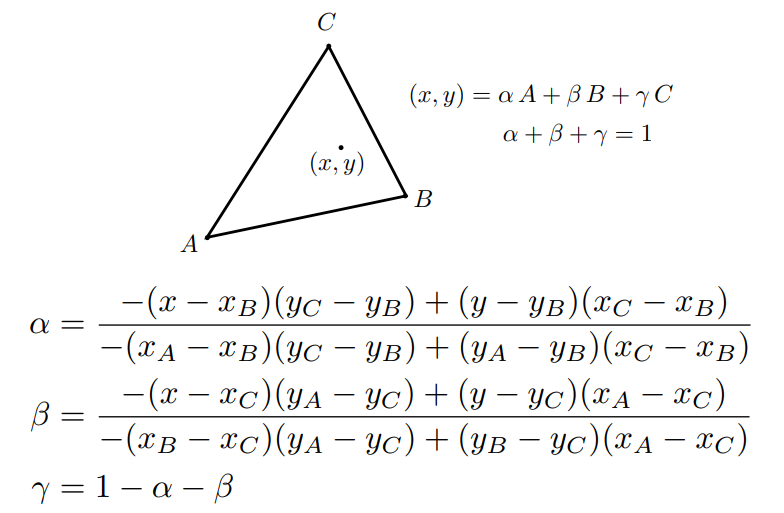</div>

上式化简后有代码：

```cpp
static std::tuple<float, float, float> computeBarycentric2D(float x, float y, const Vector4f* v){
    float c1 = (x*(v[1].y() - v[2].y()) + (v[2].x() - v[1].x())*y + v[1].x()*v[2].y() - v[2].x()*v[1].y()) 
        / (v[0].x()*(v[1].y() - v[2].y()) + (v[2].x() - v[1].x())*v[0].y() + v[1].x()*v[2].y() - v[2].x()*v[1].y());
    float c2 = (x*(v[2].y() - v[0].y()) + (v[0].x() - v[2].x())*y + v[2].x()*v[0].y() - v[0].x()*v[2].y()) 
        / (v[1].x()*(v[2].y() - v[0].y()) + (v[0].x() - v[2].x())*v[1].y() + v[2].x()*v[0].y() - v[0].x()*v[2].y());
    float c3 = (x*(v[0].y() - v[1].y()) + (v[1].x() - v[0].x())*y + v[0].x()*v[1].y() - v[1].x()*v[0].y()) 
        / (v[2].x()*(v[0].y() - v[1].y()) + (v[1].x() - v[0].x())*v[2].y() + v[0].x()*v[1].y() - v[1].x()*v[0].y());
    return {c1,c2,c3};
}
```

需要注意的是，重心坐标存在一个**问题**：三角形在投影变换下，是不能保证重心坐标不变的。因此，如果想要插值三维空间中的属性，需要将三角形变换到三维空间中，在对其进行重心坐标插值。

<div align="center">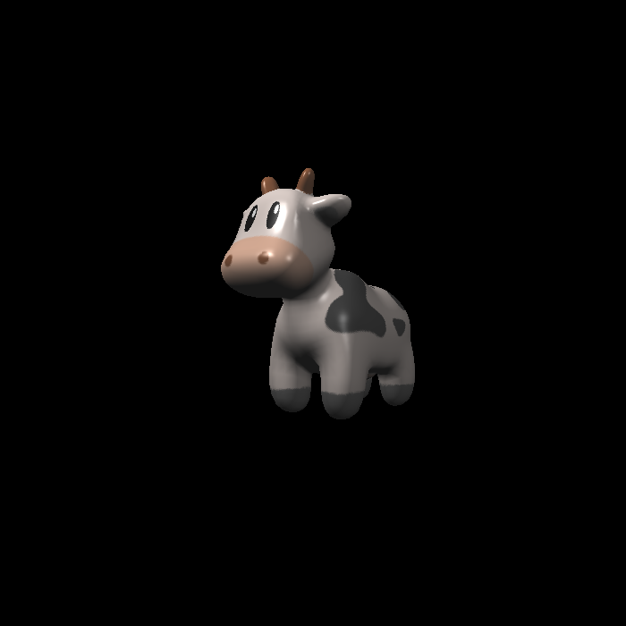</div>

在完成了屏幕中的 Pixel 与纹理中的 Texel 的插值映射之后，接下需要解决的是纹理自身的问题。如果纹理精度特别小或者纹理精度特别大的情况下，该如何获得更好的着色效果。

### 双线性插值 Bilinear Interpolation

当纹理的分辨率比屏幕分辨率小时，这时候需要用插值来令采样有一个平滑的过度。

假设当前采样的像素被映射到纹理坐标中的红点位置，其插值过程具体如下：

1. 取离它最近的四个采样位置 $u_{00}$， $u_{01}$， $u_{10}$， $u_{11}$ ；
2. 计算四个采样位置间的偏移量水平距离 $s$ 和 竖直距离 $t$ ，假设这两个偏移量取值范围为 $[0, 1]$ ;
3. 首先对水平/竖直距离进行两次线性插值得到辅助点 $u_0$， $u_1$
   - $u_0 = lerp(s, u_00, u_10)$
   - $u_1 = lerp(s, u_01, u_11)$
4. 最后再在竖直/水平方向上对辅助点 $u_0, u_1$ 做一次线性插值得到最终结果
   - $f(x, y) = lerp(t, u_0, u_1)$

<div align="center">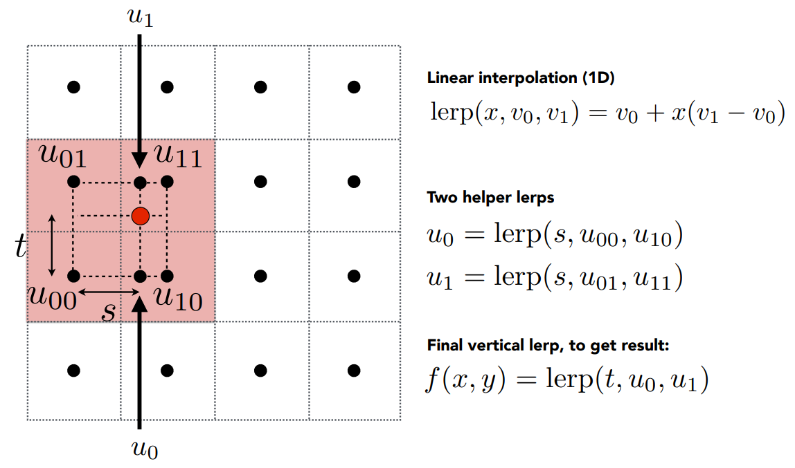</div>

除了双线性差值可以处理纹理小但几何大的情况，双立方（Bicubic）插值也可以改善该问题，效果比双线性插值还要好，但计算量大。他的主要思想是取周围 16 个纹素取平均，而每次操作用 4 个纹素做三次插值（非线性的）。

### Mipmap

当纹理像素过大时，反而会在着色中引起更严重的问题。

<div align="center">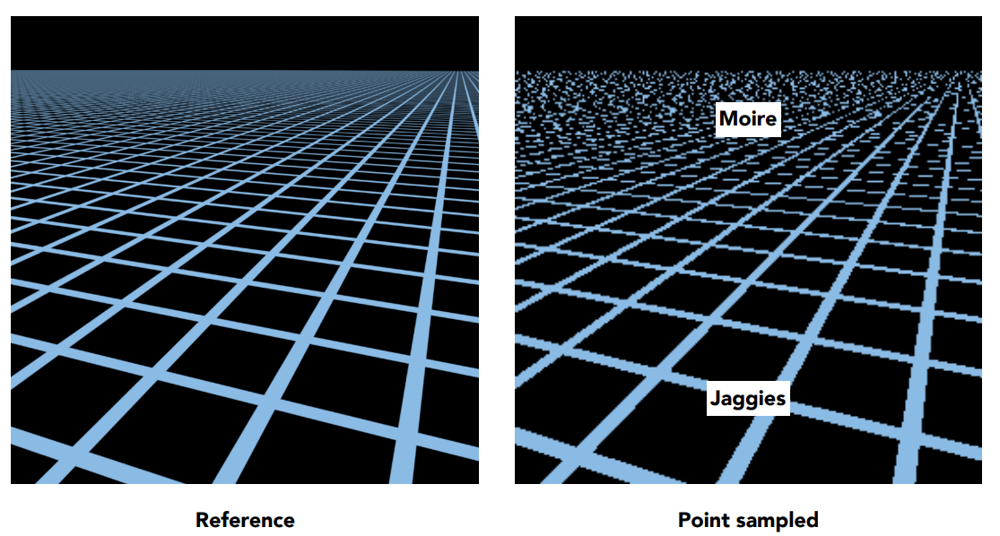</div>

在采样过程中，由于纹理分辨率很高，而我们光栅化后的单个像素可能包含数个纹素，即采样频率跟不上信号频率，从而产生走样（Jaggies）和摩尔纹（Moire）现象。

在近处，对于一个像素来说，它对应在纹理中的区域相对较小，而在远处，一个像素对应在纹理中覆盖了很大的一个区域。也就是说，屏幕中的像素，对应在纹理中覆盖的区域是各不相同的。因此，如果用一个像素代表纹理中一块较大的区域，自然会得到错误的结果。

自然的，如果增大采样频率，使用超采样技术来对纹理进行采样，便会得到一个较好的结果。但问题在于，过高的采样频率会造成过大的计算开销，这也是我们不希望看到的。

既然低频的采样跟不上高频的纹理信号，Mipmap 的解决方案便是不进行采样，而直接去获取纹理区域内的均值。

Mipmap 允许我们做快速地、近似地、方形的范围查询，其主要思想是从一张图生成一系列图，然后根据采样区域的大小去近似的选择从那一张图中采样。

<div align="center">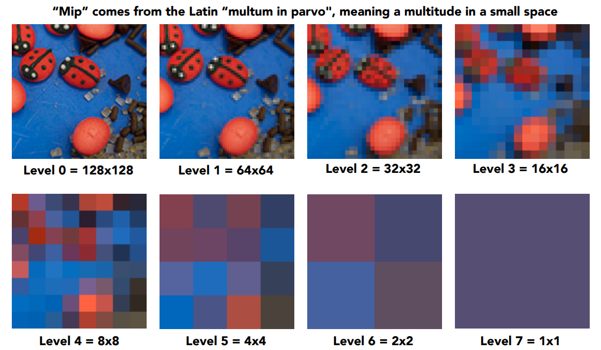</div>

对于一张像素为 $n$ 纹理图，我们对其生成 $\log n$ 张图，每一张图的像素依次减半，从而得到一个 Mip Hierarchy ，又叫 Image Hierarchy。这里，相比于原本一张纹理图的内存占用，额外生成这么多张的内存占用为 $\frac{1}{4} + \frac{1}{16} + \dots + \frac{1}{4^n} = \frac{1}{3}$ 。额外的 $\frac{1}{3}$ 显存占用对于要解决的走样问题来说，是完全可以接受的。

当使用 Mipmap 进行纹理范围查询时，通常是根据相邻屏幕采样点对应的纹理坐标来估计应当去哪一个 Level 的 Mipmap 进行查询。这里 $D$ 表明我们应从第几层查询纹理的值，也就是说该像素对应的纹理会在第 $D$ 层变为一个像素的大小。

<div align="center">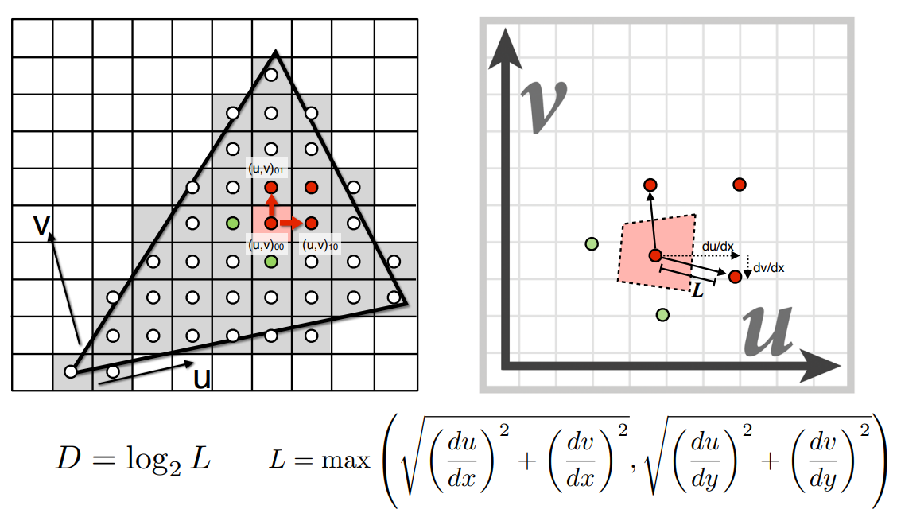</div>

但是，过度僵硬的划分（D rounded to nearest integer level）会使得查询函数不连续，从而导致结果产生明显的断层现象。因此，为了获得更加平滑的采样结果，需要对近似结果相邻两层的 Mipmap 进行插值来获得一个连续的采样结果，也就是所谓的***三线性插值***。

三线性插值，也就是进行三次线性插值哈哈。在 Level D 和 Level D + 1 分别进行双线性插值之后，再对这两个结果进行连续 D 取值的第三次插值，最终获得一个连续的采样结果。

#### 各向异性过滤 Anisotropic Filtering

然而，Mipmap 仍然有其局限性，即只能得到方形的查询范围。

实际上，屏幕空间中的一个像素，对应在纹理空间中的区域，并不总是正方形的。

<div align="center"></div>

各向异性过滤**部分**解决了这个问题。它生成的（Ripmaps）以额外三倍的存储占用，解决了上图中轴对齐的矩形区域的采样问题。但是，对于对角线对齐的区域，仍然无法很好的解决。

### 环境映射 Environment Mapping

TODO

### 凹凸/法线映射 Bump / Normal Mapping

<div align="center">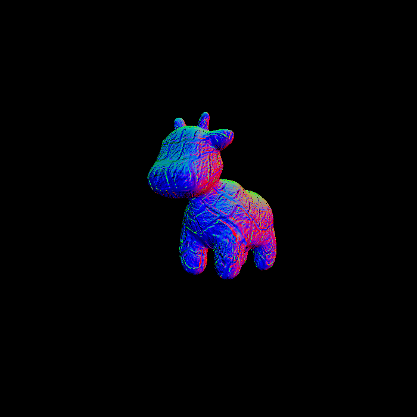</div>

## Reference

[1] [GAMES101-现代计算机图形学入门](https://www.bilibili.com/video/BV1X7411F744/?p=8&share_source=copy_web&vd_source=0010cd145c4589a828366dd2f6c17219) - 闫令琪 - bilibili

[2] [Blinn-Phong光照模型从定义到实现](https://zhuanlan.zhihu.com/p/442023993) - Ruyi Y的文章 - 知乎

[3] [对 Gamma 校正的个人理解](https://zhuanlan.zhihu.com/p/36581276) - windsmoon的文章 - 知乎

[4] [渲染管线----通俗易懂向面试官介绍](https://mp.weixin.qq.com/s/FM_Xs4GBdig0vTF6llYh1w) - 游戏君五尘 - 微信公众号
