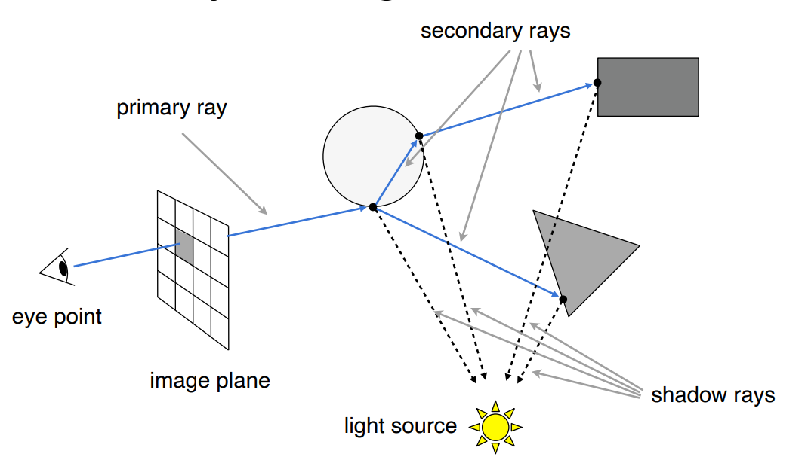
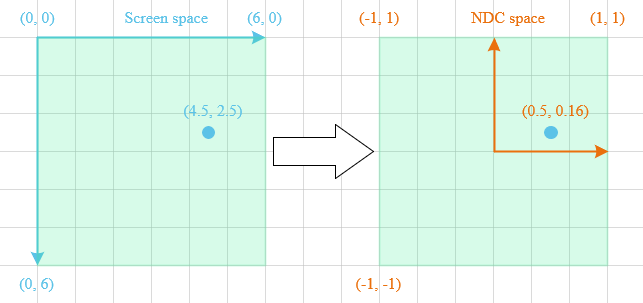
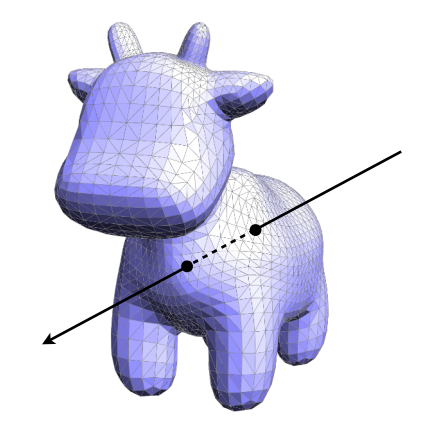
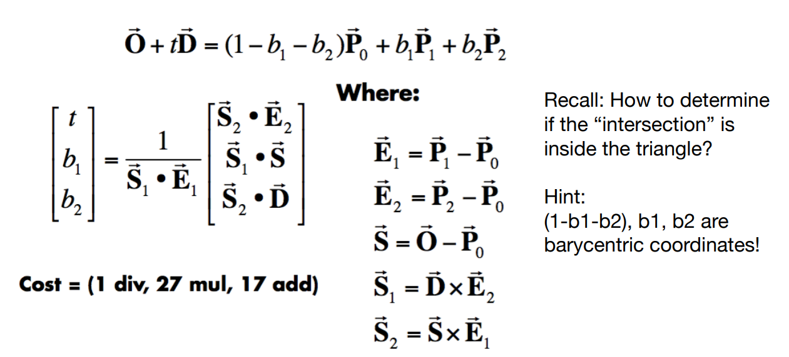

# Ray Tracing 光线追踪

光线追踪（Ray Tracing）相比于光栅化（Rasterization）是一种更为准确的渲染方法，但其主要问题是很慢。通常，光栅化是用来做实时渲染的，而光线追踪通常被用来进行离线渲染。

在之前的光栅化实现渲染的过程中，有很多全局效果的表现是很难处理的，比如软阴影、Glossy 材质物体的反射以及间接光照等。而光线追踪正是为了解决这种问题所提出的一种考虑全局效果的光照模型。

正如 Blinn-Phong 模型假设光线分为环境光、漫反射光、以及镜面反射光三项，在光线追踪中，也对光线做了以下几点假设：

1. 光线沿直线传播；
2. 相交的光线之间不会发生“碰撞”；
3. 光线从眼睛出发，并传播到光源上去。

虽然以上三条假设在现在看来没有一条是对的，但根据这些假设来模拟出全局光照的效果却完全够用了。

光线追踪是一个大的框架，其包含了递归式光线追踪（Whitted-style Ray Tracing）、分布式光线追踪（DistributionRay Tracing）、蒙特卡洛光线追踪（Monte Carlo Ray Tracing）等。

## 1. Recursive (Whitted-Style) Ray Tracing

### 1.1. Ray Casting

所谓的光线投射，其利用了光路的可逆性。光线从光源出发，经过多次反射折射等，最终进入人眼，使人们看到了光线路径中的物体。那么我们从摄像机生成一条射线穿过像素，这条射线一定会打到场景中的某一个物体上，并根据物体上的这一点发射一条射线至光源，这样便可以判定该点是否也对光源可见。如果对光源可见，那么这一点便可以进行后续的着色，如果不可见，也就意味着该点是处于阴影中的。

光线追踪的第一步便是从眼睛开始，向成像平面中的一个像素投射一根光线，这根光线会打到场景中的某一个位置，这根连线通常 Primary Ray（Eye Ray）。对于场景中的物体，考虑到遮挡关系，人眼只能够看到距离最近的物体，因此 Primary Ray 打到的第一个物体，便是人眼能够看到物体。这完美的解决了光栅化中需要深度测试的问题。

当求到光线与物体的第一个交点之后，需要考虑的便是当前交点会不会被照亮。接下来从当前点向光源发出一条射线，也就是 Shadow Ray ，来判断是否对光源可见。如果 Shadow Ray 的路径没有被任何物体所阻挡，那么也就意味着当前交点会被光源所照亮，相反的，如果 Shadow Ray 中间存在其他物体，那么当前交点就是在阴影中。

这样，我们便得到了当前交点的入射方向、出射方向以及当前点的法线材质等信息。根据这些信息，就可以算出当前点的着色，并将着色信息写入当前光线投射到的像素中。这里的着色自然可以使用各种着色模型如 [Blinn-Phong 模型]([../Assignment3/README.md#Blinn-Phong反射模型](https://github.com/Cc-Rank/GAMES101/blob/main/Assignment/Assignment3/README.md#blinn-phong-%E5%8F%8D%E5%B0%84%E6%A8%A1%E5%9E%8B)) 等进行局部光照计算。

如果光线追踪仅仅是在第一步 Ray Casting 就停止的话，光线只弹射了一次，那么它的效果与局部光照模型是一样的。因此我们需要第二步，真正的考虑全局效果。

### 1.2. Recursive



第一步中，当 Primary Ray 与第一个打到的物体相交时，假设该圆球是一个玻璃材质的，可能有两种现象发生：反射与折射。这便有了 Secondary Rays。

反射与折射出去的光线会可能与场景中的物体再次碰撞，发生第二次折射与反射。因此每一个交点的颜色贡献来自这样种几类型 直接光照，反射方向间接光，折射方向间接光。而这些再次碰撞的每一个点，都需要进行一次着色，并最终将所有点所计算出的局部光照模型的结果，将其按照光线能量权重累加，最终写到近投影平面的像素中去。这也就是一个递归（Recursive）的过程。

> Whitted-Style 光线传播意味着在任意一个点，只要能够求出入射方向与反射/折射方向，那么光线就可以一直传播下去。

上文简要概述了 Whitted-Style 光线追踪的基本原理，了解完原理之后，接下来需要做的便是一个一个的去解决实现过程中的技术问题。

## 2. 生成摄像机射线 Generating Camera Rays

整个光线追踪的第一步，便是构建出一条光线。那么应该如何构建出一条从摄像机出发，穿过屏幕，进入到世界空间的光线呢？

首先需要了解的是物体是如何从世界坐标映射到我们所观察的屏幕的，之前的一篇 [坐标空间概述](https://github.com/Cc-Rank/GAMES101/tree/main/Assignment/Assignment1#readme) 中详细介绍了在光栅化渲染过程中，从对象空间到屏幕空间的转换关系。

光线首先从被定义坐标为 $(0, 0, 0)$ 的相机出发（在几乎所有 3D 应用程序中，创建照相机时的默认位置是世界的原点）。按照惯例（OpenGL），在光线追踪中成像平面与场景位于同一侧，且通常放置在距离相机原点正好 1 个单位的位置。此外，还默认相机看向 $z$ 轴负方向。

然而，需要被写入着色信息的像素是被定义在屏幕空间中的，而屏幕的分辨率通常与成像平面（image plane）不同， 屏幕空间被定义为以左上角为坐标原点，向右X坐标增加，向下Y轴增加。如图是一个 $width = 6, height = 6$ 的屏幕空间，且像素的中心相对于像素点会有 0.5 的偏移。因此，需要将屏幕中的像素坐标转换为屏幕空间中的坐标。

<div align="center"></div>

将像素中间点的坐标转换到世界坐标需要几个步骤。

首先是把该点的坐标在屏幕空间中表示，即像素坐标加上偏移量 0.5，再将这个坐标转换为 NDC 空间，即将坐标映射到 $[-1, 1]$。

$$
\begin{aligned}
x &= 2 \times \frac{i + 0.5}{width} - 1 \\
y &= 1 - 2 \times \frac{j + 0.5}{height}
\end{aligned}
$$

常见的屏幕分辨率都是一个有纵横比的矩形，但是在 NDC 空间中定义像素坐标时，它们在 $[-1, 1]$ 范围内，因此像素都沿垂直轴被挤压或拉长。第二步中，为了使这些像素再次呈现出正方形，需要将像素中的 $x$ 坐标乘以图像像素比。

$$
ImageAspectRaio = \frac{ImageWidth}{ImageHeight}
$$

最后需要考虑的是摄像机的视野问题。

<div align="center"></div>

到目前为止，屏幕空间中定义的任何点的 $y$ 坐标都在 $[-1, 1]$ 范围内。如果从侧视图查看相机设置，可以通过将相机的原点连接到 NDC 空间平面的顶部和底部边缘来获得三角形。上文提到成像平面距离相机的原点有 1 个单位，而 NDC 空间中平面的高度为两个单位，所以很容易求得 $\alpha$ 的角度为 $\frac{\pi}{4}$，也就是说，视野或角度 $\alpha$ 在特定情况下是 $90\degree$。

$$
Scale = |BC| = \tan(\frac{\alpha}{2})
$$

屏幕像素坐标 $x$ 和 $y$ 均需要乘以 Scale 以放大或缩小它们。总之，根据宽高比 ImageAspectRaio 和视野范围 fov 还原坐标比例，最终得到世界空间的坐标。

$$
\begin{aligned}
x &= (2 \times \frac{i + 0.5}{width} - 1) \times Scale \times ImageAspectRaio \\
y &= 1 - 2 \times \frac{j + 0.5}{height} \times Scale
\end{aligned}
$$

当然，从代码来读取这一过程，相对来说更加容易理解一些。如果需要更加详细的描述，可以参考 [Ray-Tracing: Generating Camera Rays](https://www.scratchapixel.com/lessons/3d-basic-rendering/ray-tracing-generating-camera-rays/generating-camera-rays.html)。

```cpp
float scale = std::tan(deg2rad(scene.fov * 0.5f));
float imageAspectRatio = scene.width / (float)scene.height;
/*······*/
for (int j = 0; j < scene.height; ++j)
{
    for (int i = 0; i < scene.width; ++i)
    {
        float x = (2.f * (((float)i + 0.5) / scene.width) - 1) * scale * imageAspectRatio;
        float y = (2.f * (((float)j + 0.5) / scene.height) - 1) * -1 * scale;

        Vector3f dir = normalize(Vector3f(x, y, -1));
        framebuffer[m++] = castRay(eye_pos, dir, scene, 0);
    }
}
```

## 3. Ray-Surface Intersection

当有了光线之后，下一步需要解决的是如何求光线和物体表面的交点。

光线，在数学上的定义是一个简单的射线，有一个起点和一个方向：

$$
\bm{r}(t) = \bm{o} + t\bm{d}  \quad \quad 0 \leq t < \infty \tag{1}
$$

其中， $\bm{o}$ 表示光线的起点， $\bm{d}$ 为光线的方向向量，由于光线被认为是射线，因此 $t$ 是一个非负实数。

### 3.1. 光线与隐式曲面求交

首先是如何计算光线与隐式曲面的交点的方法，以一个球体为例：

$$
Sphere: \quad (\bm{p} - \bm{c})^2 - R^2 = 0 \tag{2}
$$

对于一个球体来说，其表面上所有点 $\bm{p}$, 到圆心 $\bm{c}$ 的距离是固定为 R 的， 也就得到了上述的球的隐式曲面方程。

在一个点即满足光线方程，又满足球体方程的时候，这个点就是交点。因此，联立 $(1)(2)$ 有：

$$
(\bm{o} + t\bm{d} - \bm{c})^2 - R^2 = 0 \tag{3}
$$

上式可以表示为：

$$
\begin{aligned}
at^2 &+ bt + c = 0 , \quad where\\
a &= \bm{d} \cdot \bm{d} \\
b &= 2(\bm{o} - \bm{c}) \cdot \bm{d} \\
c &= (\bm{o} - \bm{c}) \cdot (\bm{o} - \bm{c}) - R^2 \\
t &= \frac{-b \pm \sqrt{b^2 - 4ac}}{2a}
\end{aligned}
$$

这个求交关系也可以推广到一般的隐式曲面交点的计算：

$$
\begin{aligned}
& General \; implicit \; surface: \quad f(\bm{p}) = 0 \\
& Substitute \; ray \; equation:  \quad f(\bm{o} + t\bm{d}) = 0
\end{aligned}
$$

### 3.2. 光线与显示曲面求交

真正在图形学中大量运用的其实是显式曲面，更具体来说就是许许多多个三角形，因此如何判断一条光线与显式曲面的交点，其实也就是计算光线与三角形面的交点。

<div align="center"></div>

需要被注意到的是，对于任意一个三角面来说，它一定处于一个平面之上。因此，求光线与三角形的交点就被拆分为了两个子问题：1.求光线与平面的交点；2.检测交点是否在三角形内；

首先，需要知道光线和平面的数学定义。光线的定义有前文 $(1)$，而**平面**被定义为一个法线向量和在平面上的任意一点，平面公式有：

$$
(\bm{p} - \bm{p^\prime}) \cdot \bm{N} = 0 \tag{4}
$$

这个公式意味着，平面的任意一点 $\bm{p}$ 与 $\bm{p^\prime}$ 连成的向量与平面的法线 $\bm{N}$ 垂直。

联立 $(1)(4)$ ，设 $\bm{p} = \bm{r}(t)$ 并求 $t$ 有：

$$
\begin{aligned}
(\bm{p} - \bm{p^\prime}) \cdot \bm{N} = (\bm{o} + t\bm{d} - \bm{p^\prime}) \cdot \bm{N} = 0 \\
t = \frac{(\bm{p^\prime} - \bm{o}) \cdot \bm{N}}{\bm{d} \cdot \bm{N}} \quad Check: 0 \leq t < \infty

\end{aligned}
$$

关于如何判断一个点是否在已知三角形内，在之前的 [文章](https://github.com/Cc-Rank/GAMES101/tree/main/Assignment/Assignment2) 中有提到过，这里也就不再赘述。

得到参数 $t$ 之后，自然可以计算出交点，并且再去计算出重心坐标就能判断该交点是否在三角形内了，但是这种方法略显繁琐，能不能一步就得到结果呢？M${\"o}$ller Trumbore Algorithm 解决了这个问题。该算法直接将点的形式用重心坐标的形式表示，随后利用克莱姆法则求解线性方程组即可。



## 4. 反射与折射

TODO

### 4.1. 反射方向的计算

TODO

### 4.2. 折射方向的计算

TODO

### 4.3. 菲涅耳项(Fresnel Term)

TODO
