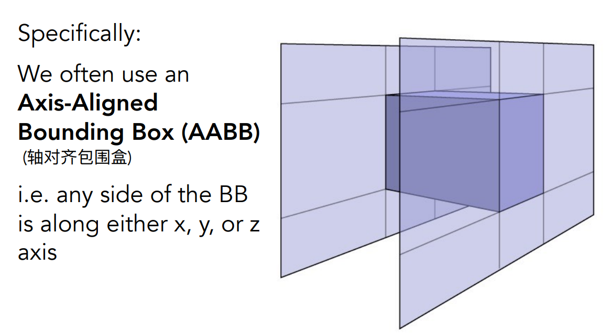
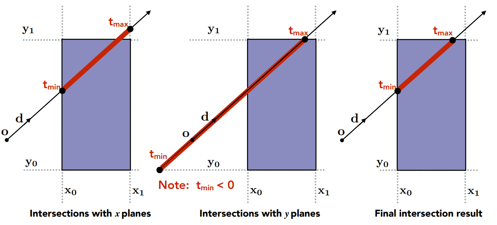
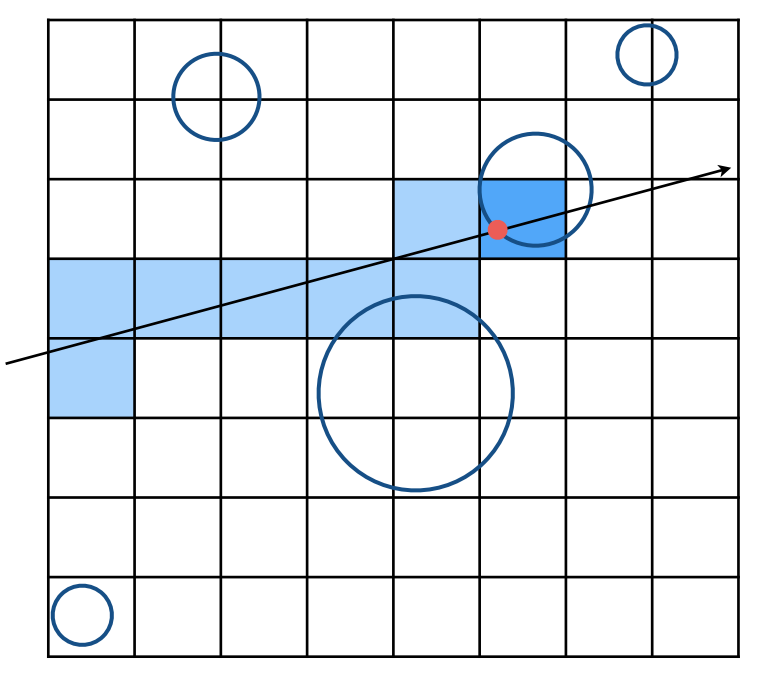
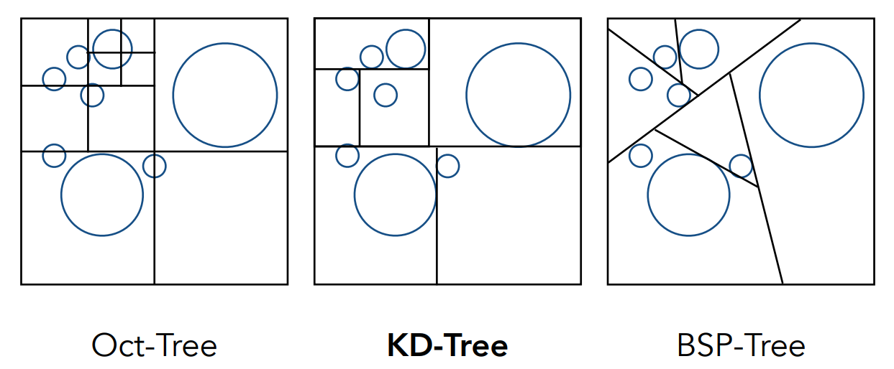
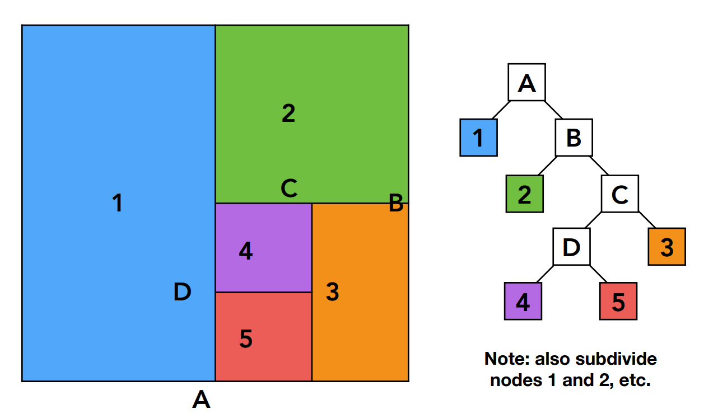
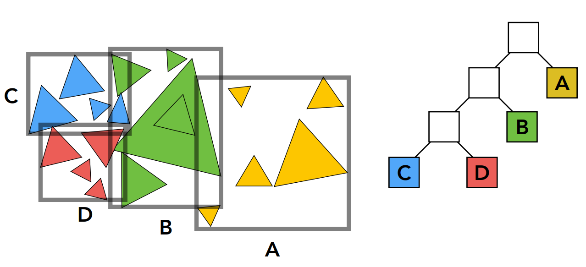
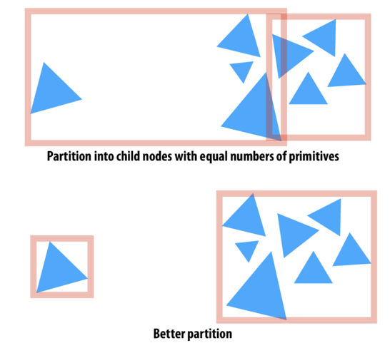
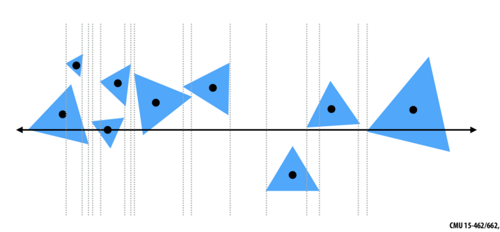

# Accelerating Ray-Surface Intersection

真实的渲染场景往往是复杂的，一个场景甚至包含上亿个三角形。在 Whitted-Style 光线追踪中，以常用的 1920 * 1080 分辨率为例，每个像素通常都需要发射出许多光线，而如果每根光线都要和每一个三角形判断求交，这计算量是难以想象的。

因此必须要寻求一些办法加速光线追踪的过程。

## 1. Axis-Aligned Bounding Box 轴对齐包围盒

首先可以想到的是，如果光线不会碰到某一个物体，那么必然不会与构成物体的三角形相交。这个想法非常简单，但十分有效。对于一个复杂的物体，可以用一个相对简单的包围体积将物体包起来，并保证该物体一定在包围盒内。如果一根光线，连包围盒都碰不到，更不可能碰到里面的物体。这个包围盒可以是任意形状，任意旋转角度的，那么什么样的包围盒更好呢？

在 3D 情况中，最常用到的包围盒是一个长方体（box）。之所以用长方体来表示，是因为它有着一个很好的性质：一个 box 可以被表示为三对平面形成的交集。换句话说，box 可以表示一对 $x$ 平面、一对 $y$ 平面和一对 $z$ 平面相交后，它们“夹”起来的区域。这样一来，方方正正的 box 便可以用简单的坐标轴来表示了，这就是轴对齐包围盒（Axis-Aligned Bounding Box）。

轴对齐包围盒（AABB）之所以被广泛使用，是因为它在计算与光线求交时的运算十分简单。[前文](https://github.com/Cc-Rank/GAMES101/tree/main/Assignment/Assignment5#3-ray-surface-intersection) 提到过光线与一般平面的求交问题。在这里，需要求交的平面均是轴对齐的平面，每次的计算仅需要考虑一个维度的分量，这就使得求交过程的计算更加的简单了。

这里以 2D 情况下为例：

如图所示，对于任何一个对面，我们都可以求得光线进入对面的时间 $t_{min}$ 和离开对面的时间 $t_{max}$。这里需要注意的是，如上图在与 $y$ 对齐平面求交的时候， $t_{min}$ 可能会是一个负数。对于这种反物理直觉的现象（时间是一个负数），下文会给出具体的解释。在得到了两组进入与离开平面的时间后，如上图最终求交结果所示，我们只需要求出 $t_{min}$ 中的最大值和 $t_{max}$ 中的最小值，便可以计算出光线进入包围盒的时间 $t_{enter}$ ，和离开包围盒的时间 $t_{exit}$ 。

这里计算最终结果的两个关键点在于：

- **当且仅当**光线进入所有对面时，光线**才**进入到包围盒中；
- **只要**光线离开任意一个对面，光线**就**离开了包围盒。

因此，如果最终的 $t_{enter} < t_{exit}$ ，那么就可以认为光线在盒子中停留了一段时间。然后，存在着一些例外情况，也就是上面提到的时间出现负数的时候，这是没有实际的物理意义的。这里定义的光线是一条射线，自然也就无法向后传播，因此，需要对结果再进行一些检查。

- 当 $t_{exit} < 0$ 时，包围盒在光线的后面，这也意味着光线和包围盒是不相交的；
- 当 $t_{exit} \leq 0$ 且 $t_{enter} < 0$ 时，光线的起点在包围盒内，因此光线和包围盒是相交的；

总结一下，当且仅当 $t_{enter} < t_{exit}$ && $t_{exit} \leq 0$ 时，光线和 AABB 相交。这个结果同样也可以推广到 3D 情况。

## 2. Uniform Spatial Partitions (Grids)

给每个模型整上一个包围盒也算是不小的优化了，但是我们相机离得近的时候，这样粗糙的结构基本没有意义了，因为每一条光线都会与整体的包围盒相交。所以我们希望能够对于模型内部三角形进行一些有意义的划分整理，形成更细的加速结构。

Uniform Grids 就是这样一种简单的结构，它将 AABB 包围盒切分为若干等大的体素，这样一来光线需要求交的部分一定在那些光线穿过的体素内。

简单来说就是将空间划分为多个均匀的小的 AABB，再根据光线方向找出相交 grid，再判断grid中是否存储了模型信息，若有则进一步求交。这里光线穿过网格的过程可以使用类似于 brenham 画线的方法来计算，同样的，在三维情况中，也有类似的求交算法如 3DDDA。

这种加速方法的主要思想是多做一些光线与格子的求交，从而减少光线与物体的求交。

当然，这里格子的划分太多会产生过多无用的计算，格子太少也会降低加速的效果。于是，在不断工程实践过程中，人们逐渐发现了一个启发式的定义格子数量的方法 $cell = C \times objs$ ，在 3D 情况下通常有 $C \approx 27$ 。

Uniform Grids 的思想虽然简单，但直到今天在某些场景的应用中仍然有着不少的使用。

## 3. Spatial Partitions

如果场景中的物体分布的比较均匀，使用格子的方法自然能够取得很好的效果，但在有些场景中，物体的分布并不是那么的均匀的。对于那些比较空旷的区域，均匀的划分为格子也会造成极大的没有必要的计算开销。如果在空旷的地方使用一个很大的格子，而在物体比较密集的区域使用更多的格子来表示，那么对于性能的提升也一定是显而易见。于是，如何划分空间便成了下一步要解决的问题。

常用的空间划分方法有如上三种。

- 第一种 Oct-Tree，也就是八叉树，每次将空间分为 8 个相等的部分，再递归的对子空间进行划分，因为图中是 2 维例子，所以只划分了 4 部分。当划分的子空间足够小或是空间中三角形面的数量很少的时候会停止划分。这种方法的显著缺点是，随着维度的上升划分的空间数量会呈指数级增长。
- 第二种 KD-Tree，也是本小节将要主要介绍的方法，其每次将空间划分为两部分，且划分依次沿着 x-axis，y-axis，z-axis，即如图中所示，第一次横着将 2 维空间分为上下，第二次再竖着将上下两个子空间分别划分为左右部分，依次递归划分，终止条件与八叉树类似。
- 第三种 BSP-Tree，其与 KD-Tree 类似，唯一不同的是划分不再沿着固定一轴，可以任意方向划分，缺点自然是划分的空间没有规则性，求交困难。

### 3.1. KD-Tree 空间划分

KD-Tree 的划分过程较为简单，并且保留了二叉树的性质。

1. 依次沿着x-axis,y-axis,z-axis划分，使得空间被划分的更加平衡；
2. 划分的位置由空间中三角面的分布决定，且拆分平面与坐标轴线平行；
3. 叶子节点存储对应空间的所有物体或三角面信息，中间节点仅存储指针指向两个子空间；
4. 当划分空间太小或是子空间内只有少量三角形则停止划分；

当 KD-Tree 建立完成之后，接下来就是判断光线与物体的求交了。

在判断相交的过程中，如果当前相交的格子是叶子结点，那么就需要对该格子中所有的物体判断求交。如果当前相交的格子不是叶子结点，那么只需要对该格子的两个子结点判断相交即可。直到光线离开包围盒或与某个物体相交为止。

但是，对于 KD-Tree 划分方法而言，其存在很严重的问题。应该如何判断包围盒与物体是否相交？理想情况下，如果三角形的某一个顶点在格子内，那么三角形便是与格子相交了。但这里存在很多例外情况，更多情况下，对于相交的判断是一个很复杂的过程。此外，一个物体很有可能与多个格子相交，在存储过程中该物体会产生很多备份。因而基于以上原因，这项技术在业界之中已经逐渐不再被使用。

## 4. Bounding Volume Hierarchy

不同于空间划分的方式，基于物体的划分很好的解决了划分的两个难点问题，并具有很好的两条性质：

1. 一个物体只可能出现在一个格子里；
2. 包围盒的边界可以通过求盒子内三角形的最小值和最大值来求得；

因而不管是实时还是离线的光线追踪，BVH 一直是当今使用最广泛的加速方式。

如上图所示，BVH 在解决了空间划分 KD-Tree 的两个问题之后，仍保留了很好的二叉树性质。其划分过程有：

1. 首先找到一个包围盒；
2. 递归的将包围盒中的物体划分为两个子集；
3. 对于划分出来的两个子集，重新计算它们的包围盒；
4. 当叶子结点中的物体数量足够少的时候便停止递归；
5. 将物体的信息存储在每一个叶子结点中；

对于如何将物体划分为两个子集这个问题，其有着两个启发式方法。第一个启发式的方法具体来说是首先从三个维度中选择一个，且总是选择最长的那个维度。这样就能够保证包围盒的划分能够趋近于合理的正方形。第二个启发式的方法是每次从中间的那个物体开始划分，也就是说对包围盒内物体当前维度的值进行排序，然后从中间将所有物体划分为两个集合。这样能够使得 BVH 的二叉树趋近于平衡，从而保证了查询次数不会陷入极端情况。

## Surface Area Heuristic （SAH）

在 BVH 中，按照物体的数量均匀的划分为两个子集固然取得了不错的效果，但其仍然存在可以改进的地方。比如当空间中的物体分布的并不均匀的时候。

直观上，我们更希望包围盒尽可能的小，并尽可能的有着更小的空白区域。因此，使得的判断光线与包围盒中的物体相交的成本（cost）尽可能的小就成了一种更好的启发式方法，那就是 [Surface Area Heuristic](http://15462.courses.cs.cmu.edu/fall2015/lecture/acceleration/slide_024)。

首先，对于一个叶子结点，我们认为其 cost 为：

$$
\begin{aligned}
C &= \sum^N_{i = 1}{C_{isect}(i)} \\
  &= NC_{isect}
\end{aligned}
$$

其中 $C_{isect}(i)$ 表示计算光线与当前包围盒内所有三角形相交的 cost。这里假设了所有三角形的 cost 是相同的。

有了叶子结点的 cost，对于一个非叶子结点，将其中的物体集合划分为两个子集的 cost 有：

$$
C = C_{trav} + p_A C_A + p_b C_B
$$

其中 $C_{trav}$ 是当前结点的一些必要花费，如加载数据，判断包围盒是否相交等。 $C_A$ 和 $C_B$ 分别是两个划分出的子集的 cost ，而 $p_A$ 和 $p_B$ 则分别是光线与两个子结点相交的概率。进一步的，如果我们已知两个子集的物体数量 $N_A = |A|$ 、 $N_B = |B|$ ，那么上式可以近似为：

$$
C = C_{trav} + p_A N_A C_{isect} + p_b N_B C_{isect}
$$

更进一步的，对于在物体 $N$ 中的物体 $A$ 与随机光线相交的概率，也就是在光线与外围包围盒 $N$ 相交后再与子包围盒 $A$ 相交的概率，可以被近似为两个包围盒的面积之比，在 3D 中为体积之比。

$$
P(hitA \ | \ hitN) = \frac{S_A}{S_N}
$$

这样，在假设光线是随机分布的，且不会与物体相交后，我们就有最终的 Surface Area Heuristic (SAH)：

$$
C = C_{trav} + \frac{S_A}{S_N} N_A C_{isect} + \frac{S_B}{S_N} N_B C_{isect}
$$

最后，在实际实现过程中，对于任意一个节点，如果有 $N$ 个物体，那么此时共有 $2N - 2$ 种划分的可能。

在最后我的渲染实验中（以渲染 Stanford Bunny 为例），SAH 在构建的过程中要比 BVH 耗时更长，约 5s ~ 9s。对于渲染时间，SAH 耗费 6s，BVH 耗时 7s，差别并不是很大。因此可能只有在特定的情况中，SAH 才能取得更好的效果。

## Reference

[1] [GAMES101-现代计算机图形学入门](https://www.bilibili.com/video/BV1X7411F744/?p=8&share_source=copy_web&vd_source=0010cd145c4589a828366dd2f6c17219) - 闫令琪 - bilibili

[2] [Surface Area Heuristic](http://15462.courses.cs.cmu.edu/fall2015/lecture/acceleration/slide_024) - CMU 15-462/662
