# Path Tracing


在之前的渲染方式中，包括 Blinn-Phong 模型、Whitted-Style 光线追踪，它们都对渲染过程做了许多大胆的假设，因此也存在着许多错误的地方。这就是的渲染的结果看起来不那么的“真实”。

因此，为了使得渲染结果更加“真实”，基于物理的渲染（PBR）就成了一种更好的选择。

## 1. Radiometry 辐射度量学

> 辐射度量学是一个物理上准确的给定一系列物理量的方法。

辐射度量学是对光照的一套测量系统和单位，它能够准确的描述光线的物理性质。基于辐射度量学，我们就可以对光源、材质、光线传播过程等进行一个更加精确的描述与计算。只有这样，我们才能得到更具真实感的渲染结果。

在辐射度量学中，引入了许多新的用于描述光的物理量：Radiant flus、intensity、irradiance、radiance 等。由于这些名词的中文翻译各有千秋，因此这里对其均使用英文描述。下面便是对这些物理量的具体定义。

### 1.1. Radiant Energy and Flux (Power)

> Definition: Radiant energy is the energy of electromagnetic radiation. It is measured in units of joules, and denoted by the symbol:
> $$
Q[j = Joule]
> $$
> Definition: Radiant flux (power) is the energy emitted, reflected, transmitted or received, per unit time.
> $$
\Phi \equiv \frac{dQ}{dt} [W = Watt] [lm = lumen]^*
> $$

Radiant flux 有时候也被叫做 power ，主要用来表示单位时间内的能量。其单位主要是 ***瓦特*** 和 ***流明***。另一种定义方式为，单位时间内其通过的光子的数量。

### 1.2. Radiant Intensity

> Definition: The radiant (luminous) intensity is the power per unit **solid angle**（立体角） emitted by a point light source.

Radiant intensity 简单来说就是从光源发出的**每单位立体角上的功率**。

<div align="center">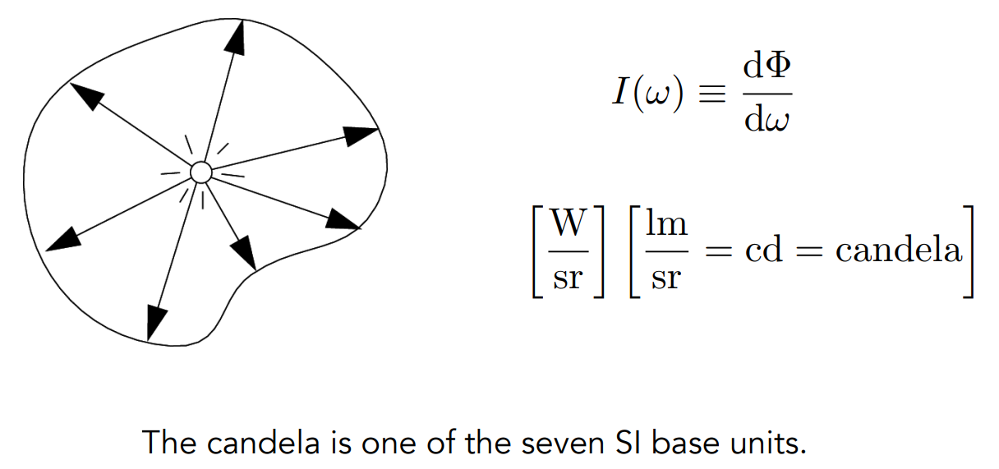</div>

那么，什么是立体角呢？

#### Angles and Solid Angles

> Angle: ratio of subtended arc length on circle to radius
>
> Solid angle: ratio of subtended area on sphere to radius squared

<div align="center">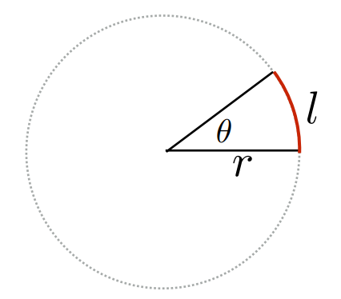 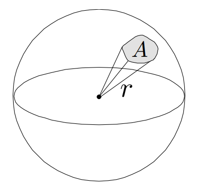</div>

如上图所示，角度的定义大家都很熟悉，弧长除以半径，且一个圆有 $2\pi$ radians 。

$$
\theta = \frac{l}{r}
$$

同样的道理，立体角就是角度在三维空间中的延伸。在 3D 空间中，从球心出发形成一个某种椎体，这个椎体会与球面相交并对应一个面积 $A$ 。那么立体角就被定义为面积 $A$ 除以球半径 $r$ 的平方。整个球的立体角即为 $4\pi$ steradians 。

$$
\Omega = \frac{A}{r^2}
$$

以下图为例，我们在球面上定义一个方向，这个方向可以用 $\theta$ 、 $\phi$ 来唯一确定。这里假设单位面积是一个矩形，那么图中横着的边相当于 $d\phi$ 长度，而竖着的边的长度为 $r \sin{\theta}$ 。这样，这个小方块也就是单位面积就有 $dA$ 。
从而根据立体角的定义，单位面积除以半径平方，我们可以得到 $d\omega$ 有：

$$
\begin{aligned}
dA &= (r d\theta)(r \sin{\theta d\phi}) \\
   &= r^2 \sin{\theta} d\theta d\phi \\
d\omega &= \frac{dA}{r^2} = \sin{\theta} d\theta d\phi
\end{aligned}
$$

这样，对于整个球面积分，就可以得到这个球的立体角度 $4\pi$ ，从而得到验证。

<div align="center">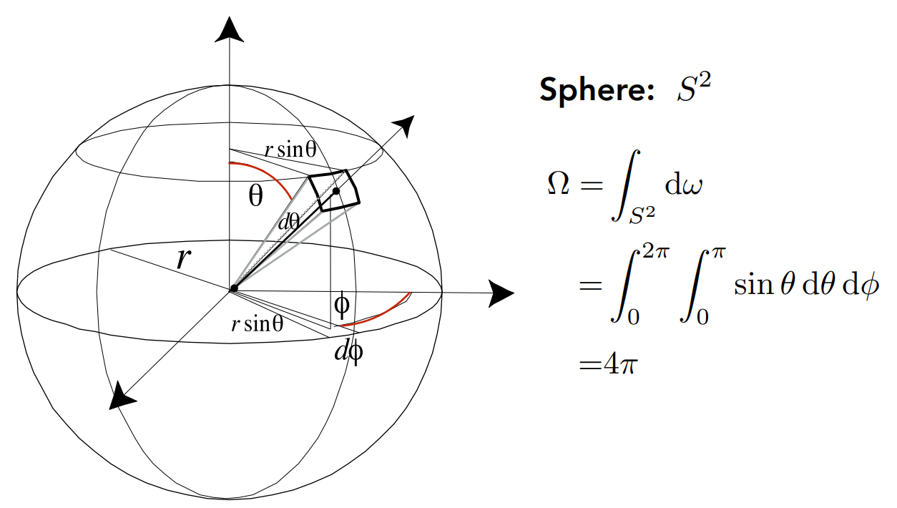</div>

在后续的概念定义中， $\omega$ 将被用来表示一个单位长度的方向向量，它由 $\theta$ 和 $\phi$ 来唯一确定。

### 1.3. Irradiance

> Definition: The irradiance is the power per unit area incident on a surface point.

Irradiance 表示一个表面点上单位面积上的 power 。

<div align="center">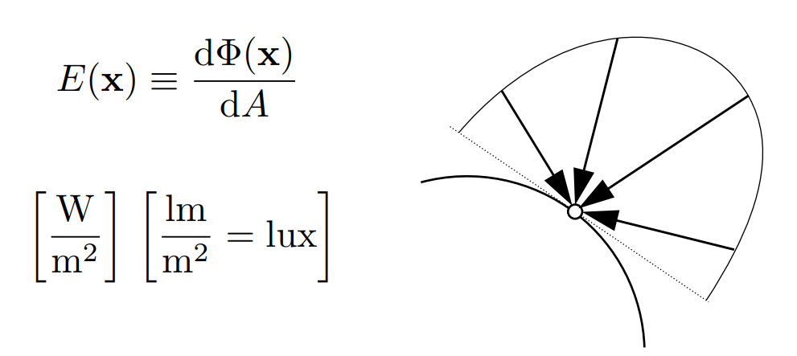</div>

需要注意的是，刚才提到的 Intensity 是单位立体角中的 power ，而这里的 Irradiance 是单位面积所接受到的 power 。

当光线垂直照射平面时，照射到平面上的面积与光线本身的“宽度一致”。但当光线斜着照射到平面时，此时的照射面积就不再是光线本身的“宽度”了，而是 $A_2 = A / \cos{\theta}$ 。可以理解为，当表面倾斜时，光在当前单位表面的“通量”就变少了。这也解释了 [前文](https://github.com/Cc-Rank/GAMES101/tree/main/Assignment/Assignment3#diffuse-term-%E6%BC%AB%E5%8F%8D%E5%B0%84%E9%A1%B9) 提到过的 Lambert's Consine Low 的合理性。

此外在 Blinn-Phong 模型中，也假设了光线在传播的过程中会不断衰减。这个假设也可以通过 Irradiance 来解释。假设光源发射出均匀球状分布的能量，那么不同时刻的能量应该是相同的。但随着球的表面积越来越大，单位面积的 power 也就是 Irradiance 是会随着半径的增大而不断减小的。

$$
E' = \frac{\Phi}{4\pi r^2} = \frac{E}{r^2}
$$

这里同样可以理解，在传播过程中单位立体角的 power，也就是 Intensity 是不会发生变化的。

### 1.4. Radiance

Radiance 主要是描述了一条光线在传播过程中带的属性，是至关重要的一个概念。它也是我们在渲染中用来计算光线所带的能量的重要定义。

> Definition: The radiance (luminance) is the power emitted, reflected, transmitted or received by a surface, ***per unit solid angle***, ***per projected unit area***.

简单来说，所谓 Radiance 就是指每单位立体角，每单位投影面积的 power ， 即我们考虑一个单位面积，向着某个方向上辐射出的能量，这个能量的大小就是 Radiance 。

<div align="center">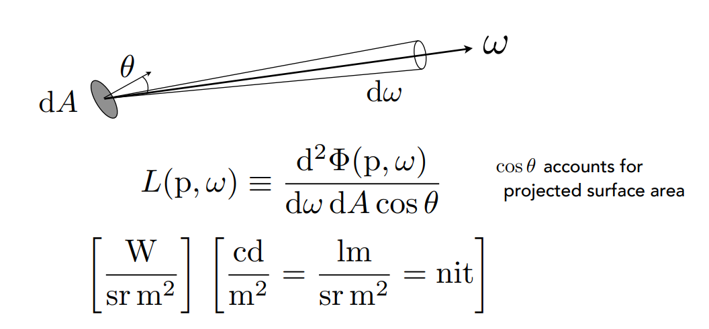</div>

> Definition: power per unit solid angle per projected unit area.

$$
L(p, \omega) \equiv \frac{d^2 \Phi(p, \omega)}{d\omega dA \cos{\theta}}
$$

这里对上面学过的概念进行一个简单复习，可能会有点绕。

首先， Irradiance 是单位投影面积的能量； Intensity 是单位立体角的能量。
那么，可以得到的是：

- Radiance ：单位立体角的 Irradiance；
- Radiance ：单位投影面积的 Intensity；

这样，我们就可以有如下两个定义：

#### 1.4.1 Incident Radiance

一条入射光线的能量有：

$$
L(p, \omega) = \frac{dE(p)}{d\omega \cos{\theta}}
$$

#### 1.4.2 Exiting Radianc

同理，一条出射光线的能量有：

$$
L(p, \omega) = \frac{dI(p, \omega)}{dA \cos{\theta}}
$$

#### 1.4.3 Irradiance vs. Radiance

相信看到这里，各位已经晕了。最后，关于图形学中用到的最多的两个概念， Irradiance 和 Radiance 再加深一下理解。

- Irradiance ：单位面积内接受到的所有能量
- Radiance ：单位面积从单位立体角所接受到的能量

用着色的角度来看的话，Irradiance 就是当前着色点所需要计算的所有光线，而 Radiance 就是每一根光线所携带的能量。举个例子，从某个方向 $\omega_i$ 的 Radiance 转化为单位面积所接受到的 power $E$ ，这个 power $E$ 将被反射为任意方向 $\omega$ 的新的 Radiance 。

<div align="center">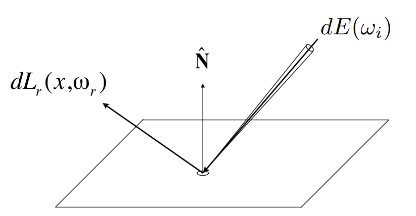</div>

那么该如何定义这个反射出去的 $dL_r(x, \omega_r)$ 呢？这就有了下文的 BRDF。

## The Rendering Equation

### 2.1. Bidirectional Reflectance Distribution Function (BRDF)

> The Bidirectional Reflectance Distribution Function (BRDF) represents how much light is reflected into each outgoing direction $\omega_r$ from each incoming direction.

$$
f_r(\omega_i \rightarrow \omega_r) = \frac{dL_r(\omega_r)}{dE_i(\omega_i)} = \frac{dL_r(\omega_r)}{L_i(\omega_i)\cos{\theta_i} d\omega_i} \quad \left[ \frac{1}{sr} \right]
$$

双向反射分布函数（BRDF），它用来描述一根入射光线从某个方向到达，并且反射到某个方向去，且反射出去的光线的 Radiance 应该是多少。简单来说，BRDF 告诉我们如何把一个反向收集到的能量反射到另一个方向去。

### 2.2. The Reflection Equation 反射方程

在有了 BRDF 之后，就可以定义出反射方程了。它可以用来计算，对于某一个点上，它的任意出射方向的 Radiance 。

<div align="center">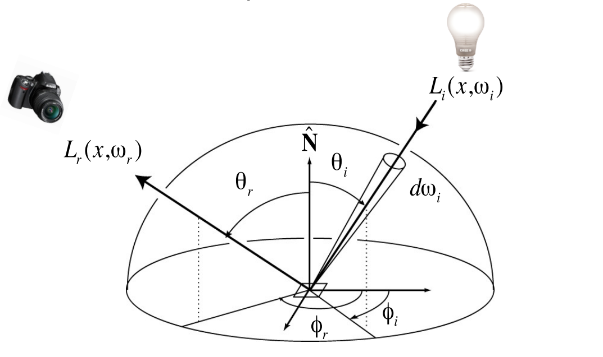</div>

$$
L_r(p, \omega_r) = \int_{H^2} f_r(p, \omega_i \rightarrow \omega_r) L_i(p, \omega_i) \cos{\theta_i} d\omega_i
$$

即，对于当前点 $x$ 在观察方向 $\omega_r$ 的 Radiance $L_r(p, \omega_r)$ ，可以由所有入射方向 $\omega_r$ 的 Radiance $L_i(p, \omega_i)$ 和点 $x$ 的 BRDF 和乘积的积分来求得。

需要注意的是，反射出的 Radiance 依赖于入射的 Radiance ，而入射的 Radiance 在其他地方也是一个出射光线，它也同样依赖于另一组入射的 Radiance。也就是说，当光线弹射不止一次的时候，反射方程是一个递归的方程。

### 2.3 Rendering Equation

在有了反射方程之后，再加上对物体自发光的考虑，我们就有了渲染方程：

$$
L_o(p, \omega_o) = L_e(p, \omega_o) + \int_{\Omega^+} L_i(p, \omega_i) f_r(p, \omega_i, \omega_o) (n \cdot \omega_i) d\omega_i
$$

> Note: 在图形学中，我们假设计算过程中的所有方向均是朝外的。

显而易见的，在渲染方程中 $L_o(p, \omega_o)$ 是未知的， $L_i(p, \omega_i)$ 也是未知的，而其他项是已知的。所以渲染方程是一个积分方程，并且属于第二类的 Fredholm 积分方程。

人们为了求解渲染方程，在经过一系列我并不是很清楚的数学推导之后，渲染方程可以写成如下形式，并被描述为一个简单的矩阵方程：

$$
L = E + KL
$$

其中 $L$ 、 $E$ 是向量， $K$ 是光线转换矩阵。可以看到式中的 $L$ 是递归定义的，那么为了求解 $L$ ，又经过了一系列我并不是很清楚的数学推导之后，最终可以得到 $L$ 。

<div align="center">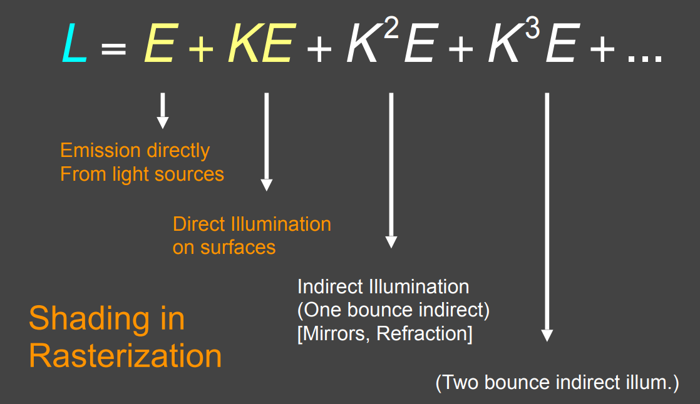</div>

其中 $E$ 为光源发出的光， $KE$ 则代表对光源反射一次的结果，即直接光照，那么前两项之和就是光栅化当中着色所考虑的结果。对于全局光照来说，还考虑了 $K^2E$，即一次弹射的间接照明， $K^3E$ 就是两次弹射的间接照明，依次类推。

至此，整个结果就很清晰了，就是光源发光加上直接光照与多次间接光照的结果。而这一切都是从渲染方程推导而来的，因此这也正是渲染方程的物理意义。

在实际渲染方程的求解中，其结果往往是逐渐收敛到某一个亮度的。因此，我们通常仅需要求解前几次光线弹射的结果，就足够模拟出真实的全局光照了。

## 3. Monte Carlo Integration 蒙特卡洛积分

当一个积分很难通过解析的方式得到答案的时候，蒙特卡洛积分可以近似得到定积分数值解。蒙特卡洛积分具体的做法可以描述为：对函数值进行多次采样求均值作为积分值的近似。

<div align="center">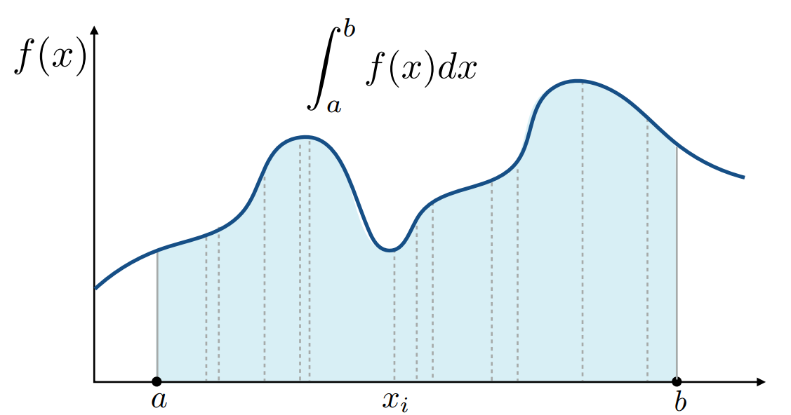</div>

想象一下如果对上图这个函数值进行均匀采样的话，其实就相当于将整个积分面积切成了许许多多个长方形，然后将这些小长方形的面积全部加起来，这就是黎曼积分。而蒙特卡洛积分考虑的是一种**随机的**采样方法，其定义如下：

$$
\int f(x) dx = \frac{1}{N} \sum_{i = 1}^N \frac{f(X_i)}{p(X_i)} \quad X_i \sim p(x)
$$

简单来说，在蒙特卡洛积分中只需要对积分域内以一个 PDF(Probability Density Functions) 采样，采样得到对应的样本 $f(X_i)$ 除以概率密度 $p(X_i)$ ，然后求平均就是最终结果了。

可想而知，如果采样数越多，得到的结果也就越准确。

## 4. Path Tracing

[前文](https://github.com/Cc-Rank/GAMES101/tree/main/Assignment/Assignment5) 介绍的 Whitted-Style ray tracing 确实能很好地渲染三维世界，但还是会有失真的成分，比如下图的 Utah Teapot。主要问题源于 shading 的两方面，一是在反射或折射的时候只做高光，二是不做漫反射。

<div align="center">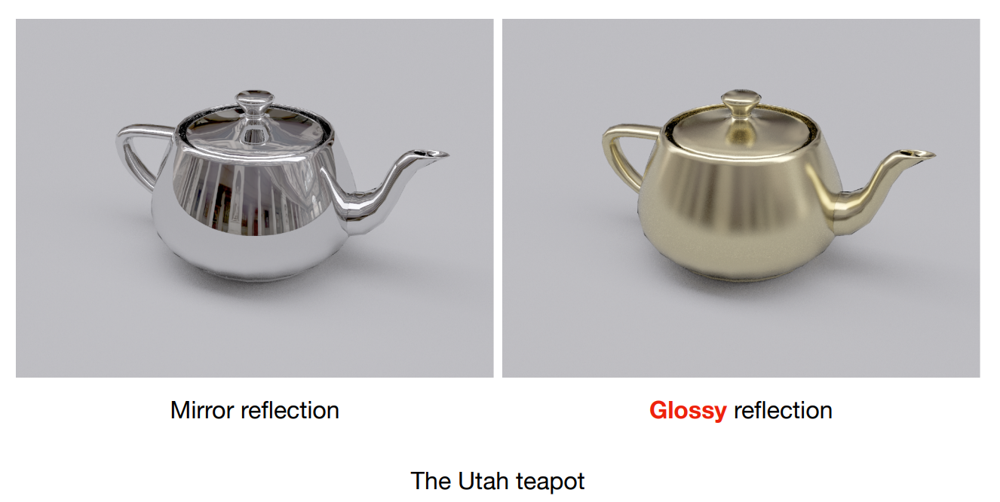</div>

为了更好地还原真实世界，我们需要能够模拟真实光照的渲染方程，然而渲染方程十分复杂有积分和递归，其推导涉及的概念有辐射测量学， BRDF 和蒙特卡洛积分。因此，要解这个渲染方程，有如下两个主要困难：

1. 需要在一个半球积分
2. 是一个递归的方程

接下来，就让我们一步一步来解决这些困难。

首先是使用蒙特卡洛方法来解这个积分。

假设先对一个点求在该点的直接光照，对于这么一个简单场景，场景中有面光源、遮挡物， $\omega_i$ 表示入射光线， $\omega_o$ 表示观察方向的出射光线。需要注意的是，在图形学中，为了方便计算，我们假设所有方向均是朝外的。

<div align="center">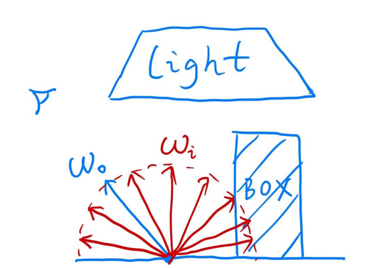</div>

对于这一个点，当然它没有自发光项，因此其渲染方程利用蒙特卡洛积分来进行求解我们可以得到如下式子。这里以均匀采样为例，概率密度函数 PDF 有 $p(\omega_i) = 1 / 2\pi$ 。当然，这里也可以使用其他采样方式，如重要性采样等。

$$
\begin{aligned}
L_o(p, \omega_o) &= \int_{\Omega^+} L_i(p, \omega_i) f_r(p, \omega_i, \omega_o) (n \cdot \omega_i) d\omega_i \\
    &\approx \frac{1}{N} \sum_{i = 1}^ N \frac{L_i(p, \omega_i) f_r(p, \omega_i, \omega_o) (n \cdot \omega_i)}{p(\omega_i)}
\end{aligned}
$$

单独仅仅考虑直接光照自然是不够的，还需要间接光照。让我们更进一步，当在点 P 采样的方向碰撞到了另一个物体的点 Q，自然会再次形成一次反射。上文提到，渲染方程是递归的，因此这样就相当于我们从点 P 看向点 Q，并想要计算点 Q 处的直接光照。因此，如果一个入射光线是从某一个物体发射而来的，我们就需要递归的进行计算所有点的渲染方程。

然而，第一个遇到的问题就是：假设一个点对 100 条入射光线进行采样，这 100 条光线又各自需要对 100 条光线进行采样，如此递归下去就形成了指数爆炸。因此需要一个折中的方案。

<div align="center">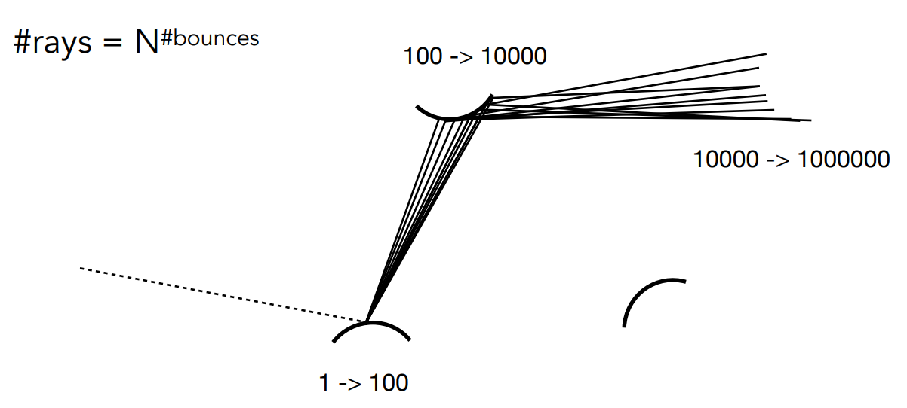</div>

那么怎么样才不会造成指数爆炸呢？考虑到 $Rays = N^{bounces}$ 我们可以知道，如果每次只对一条入射光线进行采样，那么任意指数的结果自然也就全为 1 了。哈哈这就是 Path Tracing 和 Distributed Ray Tracing 的区别了，在路径追踪中，每次只会追踪一条路径中的光线传播。

如果每次只计算一根光线，相当于每次只有一个采样点，即使蒙特卡洛积分是无偏估计，但得到的结果必然仍会产生很严重的噪声。为了处理有噪声的情况，自然而然的想法便是增加采样频率。对于每一个像素，我们从摄像机向着目标像素均匀的发射出 $N$ 根光线，最后对这 $N$ 条光线的结果求个平均。

通过对经过像素的光线重复采样，每次在反射的时候只按分布随机选取一个方向，解决了只对经过像素的光线采样一次，而对反射光线按分布采样多次所导致的光线爆炸问题。这样，我们就解决的第一个在半球上递归的积分的问题。

对于第二个问题，递归需要一个终止条件。真实世界中，一条光线是会弹射无数次的，然而计算机无法完成真实世界中光线无限次弹射的计算，因此需要对这个递归加上一个终止条件。不同于 Whitted-Style 中显式的定义了递归次数，路径追踪中采用一种非常巧妙的方法，俄罗斯轮盘赌（Russian Roulette）。以这种方式，我们就可以以一定的概率来停止递归追踪光线路径的过程。

将其应用在路径追踪当中，首先设定一个概率 $P$ , 有 $P$ 的概率光线会继续递归并设置返回值为 $L_o / P$ ，有 $1 - P$ 的概率光线停止递归，并返回 0。这样巧妙的设定之下光线一定会在某次反射之后停止递归，并且计算的结果依然是无偏的，因为Radiance的期望不变。

$$
E = P \times (L_o / P) + (1 - P) \times 0 = L_o
$$

这样，我们就完成了对渲染方程的求解过程了，以上内容写成伪代码如下所示：

```cpp
shade(p, wo)
    Manually specify a probability P_RR
    Randomly select ksi in a uniform dist. in [0, 1]
    If (ksi > P_RR) return 0.0;

    Randomly choose ONE direction wi~pdf(w)
    Trace a ray r(p, wi)
    If ray r hit the light
        Return L_i * f_r * cosine / pdf(wi) / P_RR
    Else If ray r hit an object at q
        Return shade(q, -wi) * f_r * cosine / pdf(wi) / P_RR
```

以上算法仍然存在这一个问题，那就是当前路径追踪的效率非常低。

<div align="center">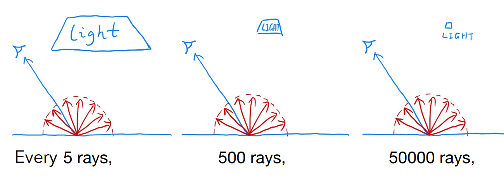</div>

从闫老师的灵魂手绘中可以看到，在每次计算直接光照的时候，之前都是均匀的从四面八方进行采样的，这样就会导致很少的光线可以 hit 光源，尤其当光源较小的时候，这种现象越明显，大量采样的光线都被浪费了。

考虑到蒙特卡洛积分允许任何形式的采样方法，所以我们可以直接从光源上进行采样，这自然就避免了光线被浪费的问题。

假设均匀的从光源上进行采样的 $PDF = 1 / A$ ， $A$ 位光源的面积。需要注意的是，在渲染方程中，我们的积分自变量是立体角 $d\omega$ ，积分域是半球面。因此需要建立一个 $d\omega$ 和 $dA$ 的换元关系。

<div align="center">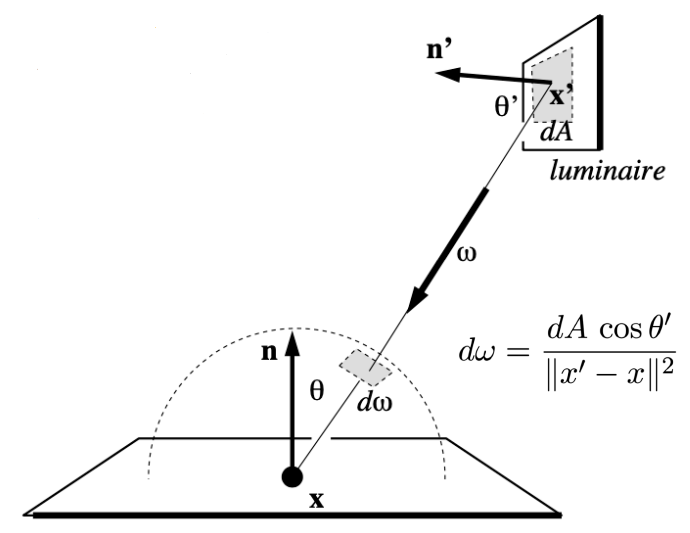</div>

如上图所示，先将光源投影到半球面上，得到 $dA \cos{\theta^\prime}$ ，然后再根据立体角的定义面积除以半径平方，从而得到下面的式子。需要注意的是，这里的 $\theta^\prime$ 是从光源与点 $x$ 的连线与光源法线 $n^\prime$ 的夹角。

$$
d\omega = \frac{dA \cos{\theta^\prime}}{|| x^\prime - x||^2}
$$

有了换元公式之后，渲染方程也就能重写如下。且概率密度函数也相应的改变 $p(\omega_i) = 1 / A$ 。

$$
\begin{aligned}
L_o(p, \omega_o) &= \int_{\Omega^+} L_i(p, \omega_i) f_r(p, \omega_i, \omega_o) \cos{\theta} d\omega_i \\
    &= \int_A L_i(p, \omega_i) f_r(p, \omega_i, \omega_o) \frac{\cos{\theta}\cos{\theta^\prime}}{|| x^\prime - x ||^2} dA\\
    &\approx \frac{1}{N} \sum_{i = 1}^ N \frac{L_i(p, \omega_i) f_r(p, \omega_i, \omega_o) \cos{\theta}\cos{\theta^\prime}}{p(\omega_i) {|| x^\prime - x ||^2}}
\end{aligned}
$$

这样一来，我们可以认为一根出射光线的 Radiance 来自于两个部分：

1. 光源方向的采样；
2. 其他所有方向的均匀采样。

最后一个小问题。在对光源方向进行采样的时候，需要考虑着色点到光源之间是否有物体遮挡的问题。如果存在遮挡，则对光源的采样直接返回 0.0f 。

到此为止，路径追踪的介绍就完全结束了，以下伪代码很好的对上文的所有介绍进行的概括：

```text
shade(p, wo)
    # Contribution from the light source.
    Uniformly sample the light at x' (pdf_light = 1 / A)
    L_dir = L_i * f_r * cos θ * cos θ' / |x' - p|^2 / pdf_light

    # Contribution from other reflectors.
    L_indir = 0.0
    Test Russion Roulette with probablity P_RR
    Uniformly sample the hemishpere toward wi (pdf_hemi = 1 / 2pi)
    Trace a ray r(p, wi)
    If ray r hit a non-emitting object at q
        L_indir = shade(q, -wi) * f_r * cos θ / pdf_hemi / P_RR

    Return L_dir + L_indir
```

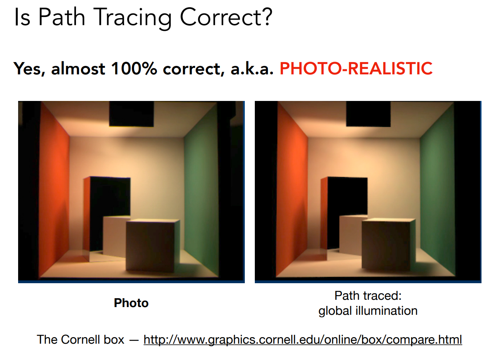
