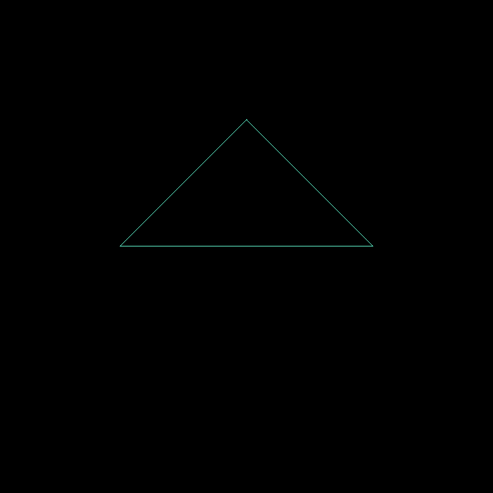
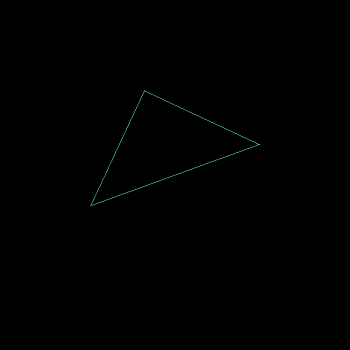
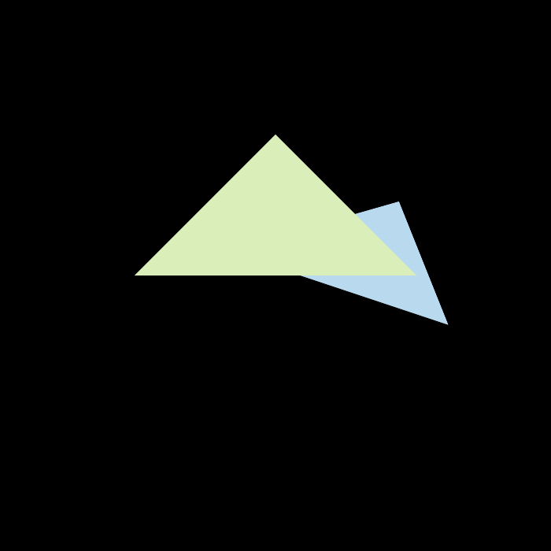
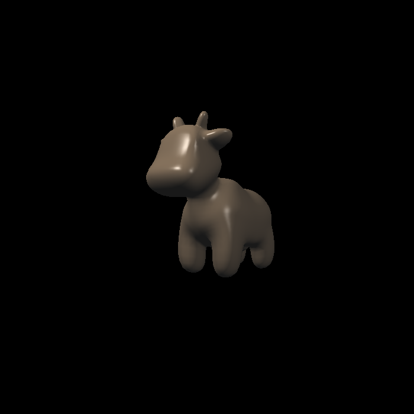
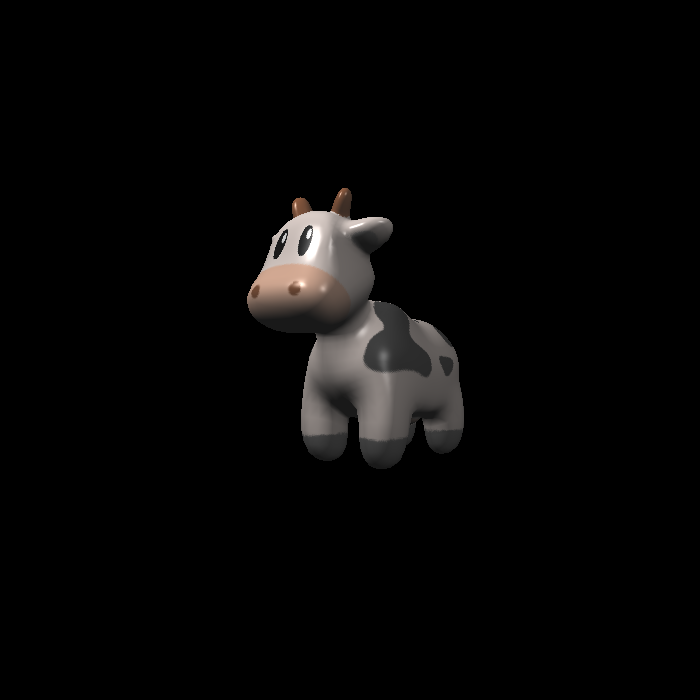
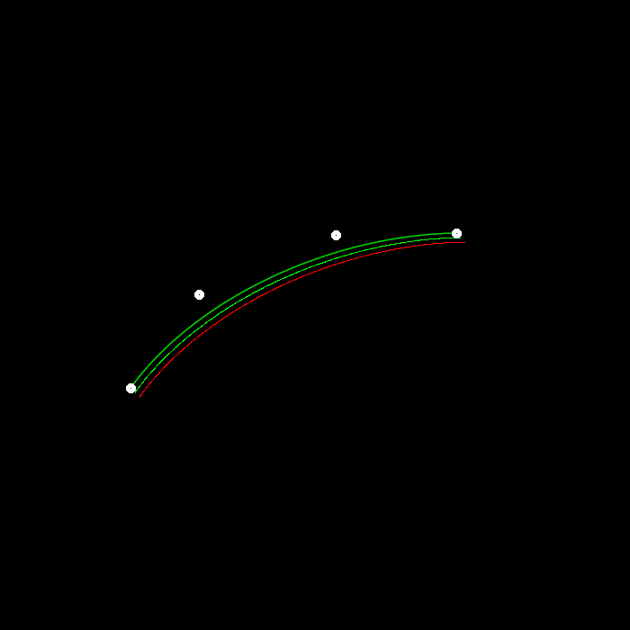
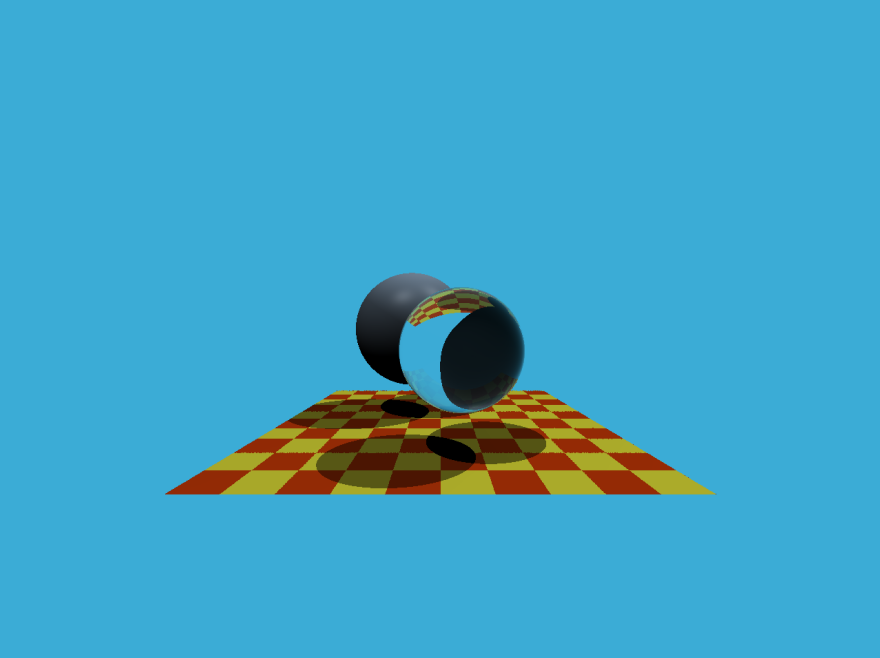
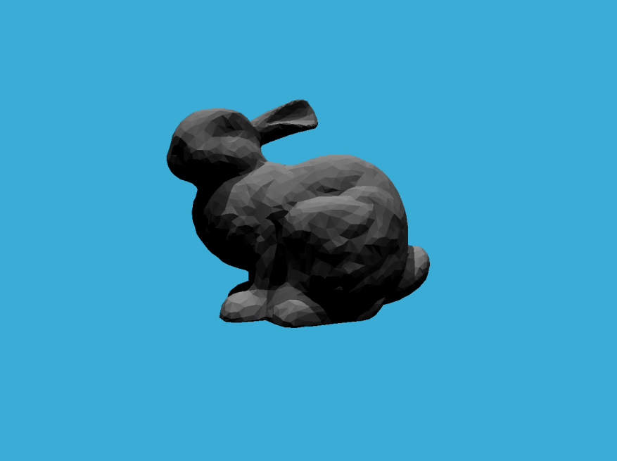
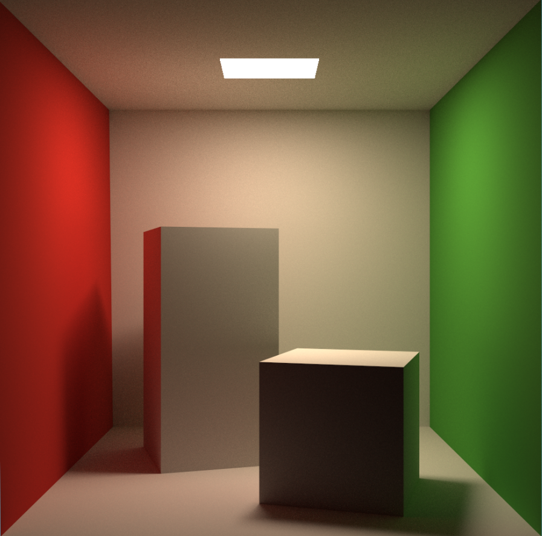

# GAMES101

GAMES101 现代计算机图形学笔记与实现

## Assignment 1: [旋转与投影](./Assignment/Assignment1/)

这里主要总结了从齐次坐标到仿射变换，再从 Model-View-Projection 矩阵变换到 Viewport 矩阵的具体过程。同时也介绍了物体是如何从对象空间转换到屏幕空间的坐标空间变化。

并以一个简单的三角形为例做了测试。

 $\quad \quad$ 

## Assignment 2: [Triangle and Z-buffering](./Assignment/Assignment2)

上一个 Assignment 只是借助 Bresenham 画线算法描绘除了三角形的外部轮廓，这里对三角形内部如何光栅化做了简单总结。

在能正确渲染出一个三角形后，下一步就是渲染多个三角形了。首先遇到的问题就是三角形之间相互遮挡怎么办？这里就用到了 Z-buffer。

同时，这里还对常见的抗锯齿算法做了简单的总结，从走样（Aliasing）到反走样（Anti-Aliasing, AA），包括：超采样反走样（Super Sampling AA）、多采样反走样（Multi-Sampling AA）与时间反走样（Temporal Anti-Aliasing）等。

 $\quad \quad$ 

## Assignment 3: [Pipeline and Shading](./Assignment/Assignment3)

这一节首先总结了如何对像素进行着色：从 Blinn-Phong 反射模型的环境光（Ambient）、漫反射（Diffuse）和高光反射（Specular）到最终结果的 Gamma 矫正。同时也对三角形内部中每一个点的重心坐标插值与透视矫正插值。

然后是纹理映射中的两个问题的解决方案。双线性插值来解决纹理像素过小的问题，与 MipMap、各向异性过滤解决纹理像素过大的问题。

最后，对渲染管线的三个阶段：应用程序阶段、几何阶段和光栅化阶段作了简要介绍。

 

## Assignment 4: bezier 曲线

这里基于 De Casteljau 算法实现了 bezier 曲线的绘制，并基于双线性插值对曲线实现了抗锯齿。

## Assignment 5: [光线与三角形相交](./Assignment/Assignment5)

这一节来到了***光线追踪***。

首先介绍了递归式光线追踪（Whitted-style Ray Tracing）的基本原理。

然后对如何从摄像机发射光线、如何计算光线与物体求交做了详细介绍。

最后总结了光线追踪中反射与折射的计算方式。

## Assignment 6: [加速结构](./Assignment/Assignment6)

本节在上一节光线追踪的基础上，介绍了一些光线追踪的加速结构，如轴对齐包围盒（Axis-Aligned Bounding Box, AABB）、Bounding Volume Hierarchy（BVH）和 Surface Area Heuristic（SAH）。

## Assignment 7: [路径追踪](./Assignment/Assignment7)

光线追踪在追求真实感的路上不断发展，因此需要更严谨的物理意义。

本节从辐射度量学开始讲起，从双向反射分布函数（BRDF）引入了渲染方程的介绍。

然后为了对渲染方程求解，又从蒙特卡洛积分（Monte Carlo Integration）引入了蒙特卡洛路径追踪（Monte Carlo Path Tracing）。

最终实现了一个真实感很强的 The Cornell Box。

